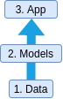
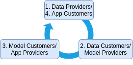

The community of AI startups in Ireland is one that we’re very close with, from our time of working on our own startup developing machine learning (ML) algorithms for motion analysis in physiotherapy applications. During our experience in the space, we have spoken to and developed relationships with a large network of other startups that are developing ML and computer vision technology. Like our own previous venture, these startups follow Web2 practices. In a previous blog [post](https://medium.com/@richardblythman/building-automated-tools-for-physiotherapy-applications-with-ocean-protocol-9d5058b58b43), the benefits that Web3 technologies can offer in the development of AI algorithms for our use case were explored, along with our development efforts in this direction.

<!--truncate-->

As a continuation of this work, we recently analysed opportunities to increase activation and awareness of Web3 values within this startup community using our recent transition from Web2 to Web3 as a template for other similar use cases. Towards this, we conducted 16 interviews with questions to assess the methods they are currently using to acquire and label data, and develop useful models and apps. We also studied their familiarity with data marketplaces such as [Ocean Protocol](https://market.oceanprotocol.com/) and new private AI technologies such as Compute-to-Data (C2D) and federated learning.

# **What do Web2 AI startup models look like?**

Let’s consider that a startup has identified a business use case using an activity such as a market feasibility study. The startup proposes that an ML algorithm can be used to provide some value towards stakeholders within this use case. However, developing such an ML model requires a lot of data. Since the startup doesn’t own any data, the first step is to collect a suitable dataset. Collecting and labelling quality data is a laborious process that takes a long time, and many startups spend years in this phase. Often, the data is labelled by human annotators. This might happen in-house under the supervision of the company (or be outsourced to another company or a platform like Amazon Mechanical Turk). The company pays the annotators a fixed, limited reward per image (maybe $1) or video and in return the annotator gives away the rights to the data. The company may also pay domain experts to add labels to the videos. Labels provided by skilled domain experts can cost up to $100 per image/video.

Once the data is collected, the startup can train a machine learning model. Often an open source ML model is used off-the-shelf, trained on the newly-collected and -curated dataset, although some startups may develop their own models. The company hires ML engineers to train these algorithms. In exchange for a salary and other benefits, the ML engineers sign contracts that give all rights to their intellectual property (e.g. code written, datasets processed, models invented, know-how acquired) to the startup.

Some startups sell access to their model through an API or SDK. Some others outsource the development of the ML algorithm (and training) to consultancy firms focusing on creating an app for a use case that they are experts in. However, the majority develop the full stack, which looks something like the diagram below. The process is linear with (relatively) sequential steps that involve (1) acquiring the dataset, (2) developing an ML model and (3) designing an app for the end user. There are a number of inefficiencies here, as described below.

*Siloing of Data*

Assets also become siloed within entities due to privacy concerns. In one case, a startup couldn’t get access to the predictions of their own models that were run on videos of patients in a hospital.

*Low Collaboration*

The development process is competitive and secretive, and collaboration between AI startups is minimal. The dataset and algorithm are considered barriers to entry (and barriers to entry are a good thing if you’ve succeeded in climbing over the barrier!). Even when startups operate in different spaces, control is given up when sending a dataset to a partner and there is a risk that the data could fall into the hands of a competitor. Licenses of datasets and algorithms are often violated, and these violations are hard to enforce since it is difficult to determine the datasets that an algorithm was trained on. Overall, this means that work such as time-consuming data acquisition and algorithm training may be duplicated across startups.

*Talent*

The skills required for the alternative steps above differ greatly, meaning that a number of very different roles such as domain expert, machine learning engineer and back-end/front-end developers must be hired for every team. Teams are always struggling to find talent to cover each area.

# **What might a Web3 AI startup model look like?**

Web3 is often considered more person-centric. More like peer-to-peer (P2P) than business-to-customer (B2C). A single individual can be a supplier and customer, or a variation of both at different stages. Analysing the actors in the AI startup ecosystem at different stages of development, we have:

1. Data providers (e.g. individual users)
2. Data customers/model providers (e.g. AI startups providing APIs and SDKs)
3. Model customers/app providers (e.g. AI startups providing end user apps)
4. App customers (e.g. individual users).

The individual providing the data and using the app are often the same. With this in mind, our Web3 model looks more like a circle than a vertical stack.

Furthermore, if we can set it up so that data providers are rewarded when the app is used, we get the feedback loop or flywheel that Web3 is famous for. Web3 is about ensuring that the value created by an application flows back to the users of that application. Aside from being fairer, this has large implications for adoption. For example, consider very early Uber drivers who were likely very influential in increasing adoption of the app, but who are no better off today as a result. Now imagine how giving early Uber drivers an ownership share of the platform (with a higher share given to earlier users) could have increased virality and adoption. How would this look for AI apps, which are unusual since user data is required before we can build a working product? We believe the answer can be found in data ownership. Data unions (like a trade union, but for data) can be formed to aggregate individual data into a valuable dataset. By encouraging contributors to hold onto ownership shares of the dataset that they provide, the value generated by algorithms and apps can be directed back in their direction.

Crowdsourcing data from users in the real world has the additional advantage of better representing the final use case. This mitigates the [gap](https://www.youtube.com/watch?v=tsPuVAMaADY) between performances of Proof of Concept (PoC) models and deployed production models. Furthermore, it reduces the issue of bias in datasets that may be collected by groups within a particular location with a particular distribution of traits. There are a whole range of unexplored opportunities here related to active and continuous learning.

We believe that a Web3 business model can also alleviate many other inefficiencies experienced by traditional models:

*Data Unleashed*

New private AI technologies can mitigate many of the privacy concerns of traditional ML practices. For example, the [Ocean](https://market.oceanprotocol.com/) marketplace provides an open source infrastructure for training on private datasets. A hospital could set up a private server for storage (e.g. local or cloud), where the data never leaves. Instead, the algorithms of an approved startup travel to the location of the data and perform some training or generate some test results. Finally, the trained model and results are returned to the startup.

*Increased Collaboration*

We also believe that an infrastructure for tracking provenance of data, model training and other IP can encourage collaboration between startups. In future, the inclusion of a dataset in a training procedure of an algorithm can be tracked on the blockchain. The flow of value to the data providers can be enforced by code, rather than trust.

*Talent Unleashed*

Rather than rigidly combining many different types of stakeholders into a single entity (with little opportunity to work across multiple entities), a more efficient approach might be to create increasingly-specialised groups that are devoted to working on a single part of the AI stack. Domain experts can work hard to collect and label data. Groups of data scientists can focus on developing ML models and training them on datasets in different domains. Software developers can reuse components of apps across multiple projects.

# **How is Algovera onboarding Web2 AI projects?**

With [Algovera](https://www.algovera.ai/) (funded by [Ocean Protocol](https://oceanprotocol.com/)), we have developed an app in collaboration with [DataUnion](https://dataunion.app/) that can be used to crowdsource videos. This opens up new avenues for AI startups to collect diverse and unbiased datasets quickly and dynamically. Our community of decentralised data scientists can then be incentivised to create algorithms on top using our designed workflows and tools. From the conducted interviews, we have created a shortlist of 10 startups that have shown an interest in becoming prospective test cases for Web3 business models and technologies. Out of these, we have obtained signed letters of intent (LOIs) from 2 startups, with specific details of experimental Web3 projects outlined. Please reach out for more details or information.