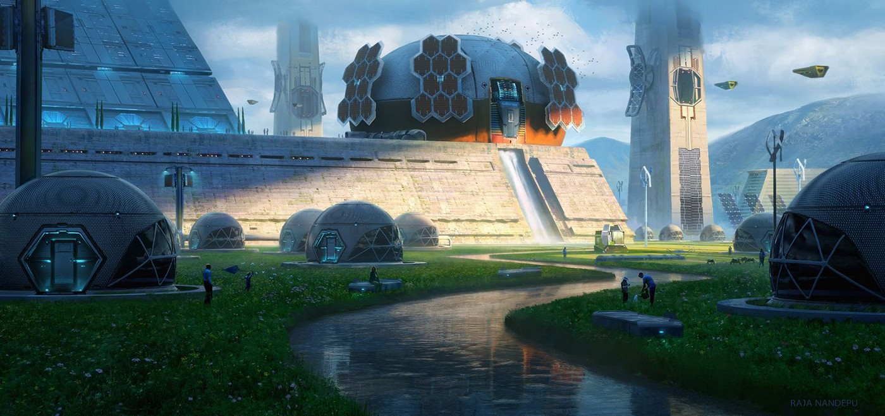
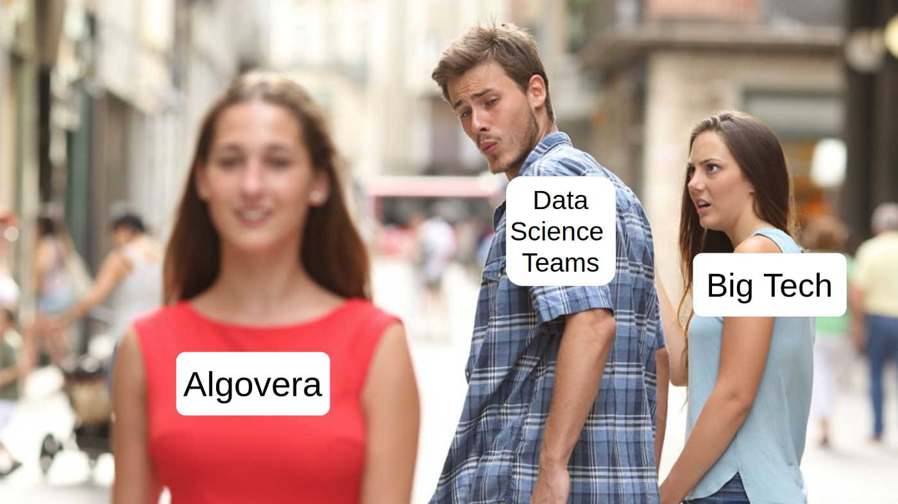
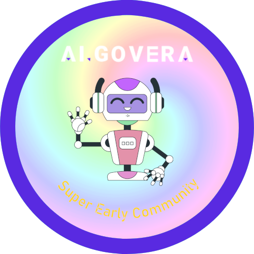
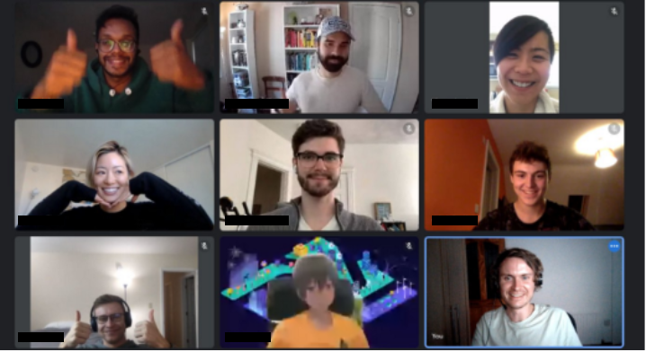

*TLDR: $5000 total budget for grants. Maximum of $1000 for each team. $1000 earmarked for underrepresented groups. Proposals open on January 1st at 12:01 am GMT. Proposals deadline on January 16th at 23:59 GMT.*

“Look around. It’s hard to believe the Algovera Grants Program built this.” — Anon, 2031

# **Introduction**

Hi, we’re [Algovera](https://www.algovera.ai/). We envision a world where independent AI developers have the freedom to work on projects that they’re passionate about. These AI developers would keep ownership of their ideas and inventions, receive rewards based on their contributions and acquire passive income based on the value generated by their creations. With this in mind, we are launching the Algovera grants program for projects that combine AI and Web3. For the first round, **$5000 worth of grants are on offer** with $1000 earmarked for underrepresented groups. Initially, the maximum grant for each individual project is $1000 (e.g. to fund one month of part-time work).
<!--truncate-->

On our journey to date, we’ve realised that achieving our vision requires adopting several new technologies. **In general, it needs to be easier for independent developers to launch useful AI apps** and we’ve identified a few things that we think might help. For example, datasets need to be more accessible and permit use for commercial purposes. The privacy of the data owners should be better preserved using maturing private AI technologies. It should also be easier to coordinate and collaborate among distributed teams using tools such as shared treasuries, governance mechanisms and project tracking. Marketplace infrastructure (such as [Ocean Protocol](https://oceanprotocol.com/)) should be available for quickly advertising and monetising processed data, algorithms and apps. And finally, cheap storage and compute resources should be more widely available for training models and storing data and weights.

Practices that include these new tools result in **a workflow that is quite different to the ones that AI teams are used to**. To better map this out, we organised a series of AI x Web3 hacking [sessions](https://www.youtube.com/watch?v=AThhcQrjRQk&list=PLgIrgqrkZC93qCxZFx_kWzk2vFdvgJjJI), where we went through the whole process of developing a toy algorithm using some of these new technologies in a shared GitHub [repo](https://github.com/AlgoveraAI/generative-art). For the reasons outlined in [this](https://medium.com/@richardblythman/unlocking-more-value-for-nft-enthusiasts-by-bringing-access-to-generative-art-algorithms-on-chain-5f3957bc7953) blog post, we chose a generative algorithm for creating art NFTs. We have since launched a DAO for the project (called a Squad) with the contributors to the project as members. Here, we will coordinate further development (such as building a user app or collaborating with artists, creators and art DAOs) and govern the future operations of the algorithm (such as value generation, ethical considerations etc.). **With this proof of concept,** **we are now looking to kickstart more development** by opening up a grants program for those with interesting ideas for AI x Web3 algorithms or apps.

# **Project Criteria**

We are interested in funding projects at the intersection of AI and Web3. The main criteria is that **these algorithms or apps should have an innovative ownership model**. They should create value for the contributors, as well as the users. While we want ideas to form from the bottom up by individuals, we give some ideas below to get the juices flowing. The easiest way to meet the criteria is to use a similar process and technology stack to the one that we have developed (it should be possible to use the hacking sessions and other resources as a guide). One example is to **find an interesting private dataset** on the [Ocean marketplace](https://market.oceanprotocol.com/) **and add some value**:

- Perform an exploratory data analysis of the dataset (of the overall statistics rather than of individual samples) and publish the results to the marketplace.
- Process the data to a useful format and publish the processed dataset to the marketplace.
- Train an algorithm on the dataset and publish it to the marketplace.

There are many other decentralised data marketplaces with interesting datasets, such as [dClimate](https://www.dclimate.net/) and [Energy Web](https://www.energyweb.org/), as well tools such as [Dune Analytics](https://dune.xyz/browse/dashboards).

Another idea is to **build on top of existing machine learning algorithms and publish to the marketplace**. For example:

- Take an existing open source machine learning model (e.g. [VQGAN+CLIP](https://ml.berkeley.edu/blog/posts/clip-art/)), publish it to the marketplace and create a community around it using a DAO with the intention of building on top.

Does this create more value compared to building on top of the original open source model in the traditional sense? Good question. We think it might open up interesting new possibilities. Excitement often builds around newly-released models (e.g. [ArcaneGAN](https://huggingface.co/spaces/akhaliq/ArcaneGAN) on HuggingFace recently). The networks that form have inherent value. What if we formalised these communities and gave its members the ability to capture this value e.g. using shared treasuries, governance and funding mechanisms?

Another idea is to **build an app that integrates machine learning models with Web3 hangouts**. We would personally love a channel in our Discord that converts text to image art using VQGAN+CLIP (just like [EleutherAI](https://www.eleuther.ai/)) or other models. Or what about a voice channel with AI-generated music?

Perhaps you are interested in [token engineering](https://blog.oceanprotocol.com/towards-a-practice-of-token-engineering-b02feeeff7ca). So are we. Developing new **economic models for** (i) **distributing the value generated by AI** and for (ii) funding AI projects are huge problems that are not well explored. Where are the AI cooperatives that are owned by the workers? An example of a token engineering project proposal might be to:

- Use an open source token engineering software such as [TokenSPICE](https://github.com/tokenspice/tokenspice) or to run simulations for distributing the value generated by an algorithm or app to the members of a DAO.
- Use an open source token engineering software such as [cadCad](https://cadcad.org/) to explore new models for funding AI projects (like the [Commons Simulator](https://sim.commonsstack.org/) but for the needs of AI projects).

If you have a commercial (rather than a technical) background, some ideas for proposals include:

- **Perform some outreach with potential buyers of an algorithm or service**. For example, maybe there is potential to collaborate with Art DAOs on generative art profile pictures. Or, perhaps artists and creators might be interested in tokenising their datasets and algorithms that are currently off chain. Alternatively, **explore the market for an AI app that doesn’t exist yet**.

We have also earmarked $1000 for projects proposed by **groups that are underrepresented in AI and Web3**. While the open, global and permissionless nature of Web3 improves accessibility compared to Web2, it remains the case that most are pushed down the rabbithole by a peer. This is less likely to happen if your group is underrepresented. For this reason, we want to make a conscious effort to reach out to these groups.

# **Proposal Process**

So you resonate with our mission and have an idea for a project. What are the next steps? Below, we talk about what the submission, discussion, voting and funding process for Algovera grants will look like. If you have some suggestions for improvements, we’d love to hear them.

**Submission and Discussion**

The first step is to write up a proposal for your idea (about one A4 page) following [this](https://forum.algovera.ai/t/grant-proposal-template/15) template. As a rough guideline, the deliverables might be designed to be achievable in one month of part-time work. The proposal should be posted to the Algovera Discourse forum under the [Proposals](https://forum.algovera.ai/c/proposals) category before the proposal deadline (January 16th at 23:59 GMT). A period of 7 days will follow for community feedback and discussion. This should take place primarily in the comments sections of the project posts in the forum. Projects will also be given the opportunity to present their proposals in the Algovera Town Hall on Monday, January 17th.

**Voting**

Voting will take place over a three day period. We will distribute POAPs to contributors in the Algovera [community](https://www.notion.so/Algovera-Community-8c716f8d8ebb49528ec0d1834ad2c49d). Each NFT gives one vote. For the first round (at least), you cannot vote against a proposal. Proposals will be ranked based on the number of votes, and the grants distributed accordingly (e.g. the top 5 projects get $1000). We encourage unsuccessful grants to stick around. We are just getting started!

Algovera POAP to be distributed for Super Early Community members for voting

**Funding**

Following RAID Guild, we will distribute 50% of the funds upfront through a smart invoice, with the final 50% released upon meeting deliverables. The initial funds will be disbursed within one week of the end of voting. Projects are welcome to apply for each round of funding.

**Algovera Squads**

Squads are decentralised AI teams in the Algovera ecosystem. We want to fund squads rather than individuals with the aim of promoting collaboration and advice-giving between community members. AI development is [different](https://arxiv.org/abs/2001.06684) to traditional software development in that it requires more different types of stakeholders, such as domain experts who know the data very well. With Squads, we eventually hope to make it easier for different stakeholders to come together and coordinate. A squad has the option of having only one person. Or only one lead developer with one or two advisors or other stakeholders (where the developer receives the majority of the salary and expenses). Or larger teams.

We will create a Squad for each successful proposal. A squad is essentially a project DAO with a shared treasury and governance (e.g. voting). Using our DAO tools, it will be possible to perform all of the actions that AI teams need to take such as publishing assets on marketplaces. This means that we can automatically direct any value generated by project assets to members of the Squad. The member tokens of the Squad will be distributed among the proposing team with 5% kept for the Algovera treasury. What happens with any value generated by this share will be governed by the Algovera community e.g. used to fund more AI Squads in the ecosystem.

**Commercial**

We want Algovera to be a self-sustaining ecosystem. To achieve this, we need to implement something like a [Web Sustainability Loop](https://blog.oceanprotocol.com/the-web3-sustainability-loop-b2a4097a36e) or kickstart the [Network Flywheel](https://www.youtube.com/watch?v=AI1N6dY8vSQ) for our AI community. The aim is to direct resources to the projects that are most likely to grow Algovera. The OceanDAO grants program formulates this requirement as a Return on Investment (ROI) of greater than 1.0, or more recently as a Value Add [criteria](https://github.com/oceanprotocol/oceandao/wiki/project-criteria) (due to the difficulties with measuring ROI). We want to experiment with something a bit different. We want to allow for the possibility of bringing technical stakeholders together with commercial stakeholders. We have no prerequisites at all for a commercial or growth plan for your idea. Instead, we will ask our commercially-minded community members to give advice and feedback during the discussion phase and beyond. We hope that this sparks relationships, and maybe even helps teams to further form. However, it is completely up to the projects and individuals.

# **Test Run with Generative Art Grant**

As mentioned, we recently launched our first Squad around a generative art algorithm. This was the outcome of a series of AI x Web3 hacking [sessions](https://www.youtube.com/watch?v=AThhcQrjRQk&list=PLgIrgqrkZC93qCxZFx_kWzk2vFdvgJjJI) and contributions to a shared GitHub [repo](https://github.com/AlgoveraAI/generative-art). As an initial test run, we want the Algovera community to vote on providing this Squad with $1000 funding that will be used for further technical (such as building a user app) and commercial (e.g. go-to-market research) development. We will post a grant proposal on our forum in the coming days, and invite feedback and discussion from the community. Voting will commence on 1st Jan with a voting deadline on 4th Jan.

# **Conclusion**

We hope you’re as excited as we are for our first round of grants. For more information, check out our manifesto on the Algovera [website](https://www.algovera.ai/) or dive into the resources on our [Notion](https://www.notion.so/Algovera-707678b772b9490097d2485db5f4a6e4). Make sure to join our [Discord](https://discord.com/invite/e65RuHSDS5) and let’s start brainstorming on ideas. Reach out to Richard (richardblythman | Algovera.ai#3425) with any questions you might have about the program.

We hope to open up more opportunities and documentation on contributing to Algovera in the coming months. This includes taking part in the AlgoveraDAO working groups (called Pods) as well as other roles, bounties and grants. In the long run, we want to provide many different types of income and ownership opportunities for AI developers.

An Algovera community session

# **Acknowledgements**

We’re deeply grateful to the communities that have supported us. [OceanDAO](https://oceanprotocol.com/dao) have funded us since grants R7, and we work closely with OPF and projects in the eco-system. We’re also fellows of the [Kernel](https://kernel.community/en/) Block 4 accelerator, and have tried to deeply bake the first-principles thinking and community practices that we learned there into our community. Check out our Kernel adventure/guild on [decentralizing AI](https://kernel.community/en/build/decentralized-ai/).