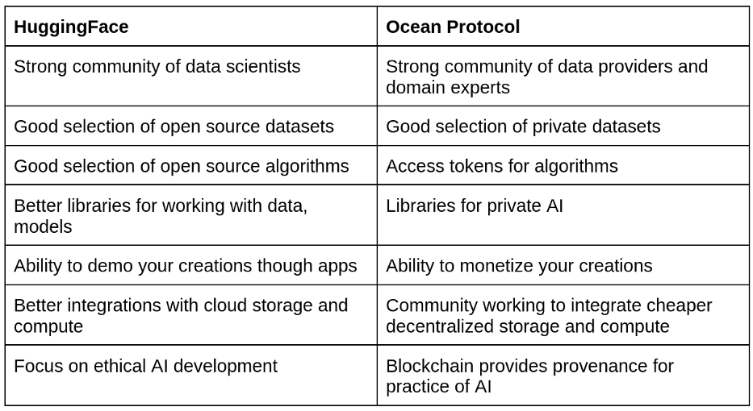

HuggingFace is an online community of data scientists with a mission of making it as easy as possible to to train, optimize, and deploy models. HuggingFace Hub aims to provide a central place for collecting models, datasets and metrics. The model hub offers thousands of pretrained models to perform tasks on different modalities such as text, vision, and audio. HuggingFace Spaces provides a simple way for data scientists and organisations to demonstrate machine learning apps. It provides access to cloud compute and accelerated deployment.
<!--truncate-->

Ocean Protocol is an infrastructure for building data (and algorithm) marketplaces, with the aim of giving ownership of data back to data providers while also unlocking the value of siloed data. Their software is open source including everything from the marketplace frontend to the compute provider. OceanDAO offers grants curated by the Ocean community every month.

The HuggingFace and Ocean communities differ in expertise and focus, but share many similar underlying values. Both are strong proponents of open source and open science. Both create tools to further responsible development of AI. In this blog post, we explore what the integration of these technologies and communities can offer.

# **Comparing HuggingFace and Ocean**

The development of useful machine learning software is quite different to traditional software development in many ways. One example is that the practice requires a larger number of stakeholders with different backgrounds collaborating to extract insights from data. This includes data scientists (who undertake technical activities such as data cleaning, feature extraction, data modelling and evaluation of results) as well as domain experts (who engage in non-technical activities such as data labelling and interpretation of results). This [paper](https://arxiv.org/abs/2001.06684) provides further reading for those interested in how collaboration happens in data science projects. HuggingFace has a thriving community of data scientists, while Ocean has a strong community of domain experts in fields such as healthcare, climate and finance.

Advantages of HuggingFace and Ocean Protocol

The datasets on HuggingFace Hub are all open source. This fits with the ethos of data scientists: Data should be open and free. In fact, interviewees often tell me that data scientists will never pay for data. I don’t disagree. Open source data is great for benchmarking results of state-of-the-art research. However, it’s often only available for non-commercial purposes. Data scientists who work for tech companies will have used many datasets that are not open source. Those involved in AI startups will likely have taken part in many months of acquiring and labelling a dataset for a specific use case, since available open source datasets aren’t good enough. Private datasets are widely used to generate value. Ocean has a growing selection of private datasets that can be purchased to build models for commercial applications. Furthermore, Ocean provides infrastructure for private training and testing of algorithms, such as a technique called compute-to-data (C2D). With C2D, the algorithm travels over the network to the location of the data, runs on the dataset and the results (or the trained weights) are returned to the data scientist. Privacy-enhancing technologies like this have the potential to open up new applications, such as models for sensitive data (e.g. healthcare). It can also encourage collaboration between different organisations since control of the data is maintained.

HuggingFace has a focus on ethical AI development, and some of the features of Ocean can help to facilitate this. For example, HF use cards can be used to record the limitations, potential bias or ethical considerations of models. However, it’s currently difficult to audit the practice of data science. In my experience in the field, licenses for datasets and software are often broken, and there is little consideration for ethics. The blockchain used by Ocean can be used to track provenance of data, training procedures and IP.

# **Integrating Ocean and HuggingFace**

The following presents some advantages of integrating HuggingFace and Ocean libraries. We also link to some of the proof of concepts that we’ve developed.

**Tokens for Data and Algorithms on HuggingFace**

Why do datasets (and algorithms) need tokens? Tokenizing assets can offer a few benefits. Firstly, they act as access tokens that can only be used by one individual or for a period of time. These tokens could be given away for free, or used to earn income independently. Data scientists will be familiar with needing to register for access to datasets. After making a request to the owners (sometimes with information on the intended use case), the data scientist might receive a link or a login. This could use a traditional access token like OAuth 2.0. The issue is that this link or login can be shared with multiple people, and it’s difficult to give fine-grained permissions. Tokens give you better control and governance over assets that you [own](https://blog.oceanprotocol.com/data-tokens-1-data-custody-1d0d5ae66d0c). This is one of the fundamental principles that Web3 espouses.

**Wallets** **for Data and Algorithms on HuggingFace**

Tokens are held in a Web3 wallet. A Web3 wallet has a public key and a private key, which you can think of like an email address and password. Your private key should not be shared with anyone. The word wallet tends to have financial connotations. However, wallets are often used in the real world as a place where you hold identity documents (such as a driver’s license). Similarly, Web3 wallets can be used for identity in the digital world. A single Web3 wallet can be used to log in to many different Web3 apps (such as the Ocean [marketplace](https://market.oceanprotocol.com/)), meaning that you don’t need to register with a username and password for each. Ultimately, Web3 wallets are your ticket to ownership of what you create online as a data scientist. You could publish your creations (such as datasets, algorithms and apps) on multiple platforms, while not losing control of the intellectual property (IP).

We created a very simple proof of concept of a Web3 wallet [app](https://t.co/9UYjTwGQ1K) on HuggingFace Spaces, where you can check the balance of data and algorithm tokens that you hold. This uses the Ocean Python [library](https://github.com/oceanprotocol/ocean.py) in the backend (check the [app.py](https://huggingface.co/spaces/AlgoveraAI/algorithm-web3-wallet/blob/main/app.py) for the space). Currently, the app uses test tokens that have no real value. For a detailed tutorial on how to use the app, check here. Unfortunately, there are quite a lot of steps. This creates friction for onboarding data scientists to Web3. One of the issues is that it wasn’t built for data scientists. In future, wouldn’t it be cool if we could create a Web3 wallet native to Gradio or Streamlit? This would work directly in notebooks and also HF Spaces. This would make it easier for data scientists to onboard to Web3 for the first time using tools they know.

**Token-gated Datasets on HuggingFace**

With Ocean, you can effectively create private datasets on HuggingFace. As a reminder, private datasets on the Ocean marketplace come in two flavours. The first provides full download access to the dataset after purchase. The second gives access for an approved algorithm to run on the data after purchase (Compute-to-Data). In this case, the results of the algorithm or a pre-trained model are returned to the data consumer, but not the data itself. The main use case here is likely for Ocean datasets that have download access. We created a proof of concept for this [here](https://huggingface.co/datasets/AlgoveraAI/CryptoPunks) using a dataset of CryptoPunks images. This allows HF users to control access to download links, or earn income from datasets that they acquire or process. Furthermore, it would give data scientists in the Ocean community access to the handy HF datasets [library](https://github.com/huggingface/datasets). Currently, there’s more boilerplate code required for the Ocean Python library.

It would also be possible to use HF Hub for downloading the sample data of Ocean datasets that provide compute access only. Determining statistics of the full dataset is also possible, but would require an app.

[art](./art.png)

CryptoPunks

**Token-gated Apps on HuggingFace**

We’ve created an [app](https://huggingface.co/spaces/AlgoveraAI/dcgan-crypto-punks) on HF Spaces for demonstrating a generative model that requires tokens to run the algorithm. The app serves the algorithm from the Ocean marketplace using the Ocean Python library in the backend. Users need to input the private key to their algorithm wallet, which should contain a balance of Ocean tokens. The app then exchanges some of these Ocean tokens for algorithm tokens and runs inference of the pre-trained model. As before, test tokens are used that have no real value.

# **Conclusion**

In this blog post, we’ve discussed some ideas for integrating the functionality of HuggingFace and Ocean and showcased some of our proof of concepts. At [Algovera](https://www.algovera.ai/), we want to empower data scientists to keep ownership of their creations using tokens and wallets. We are building tools to make it easier for data scientists to create and monetize useful AI apps. We envision a world where independent teams of data scientists and domain experts work together on projects that they are passionate about. If you have an idea for a project that combines data science and Web3, please consider applying for one of our [grants](https://medium.com/@richardblythman/introducing-algovera-ai-x-web3-grants-ccc63c986878).