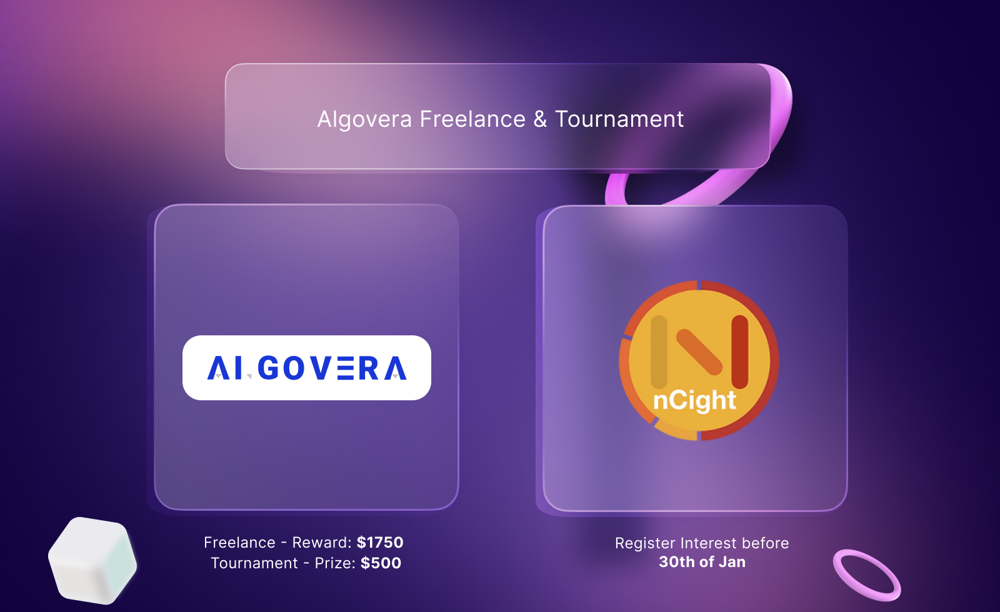
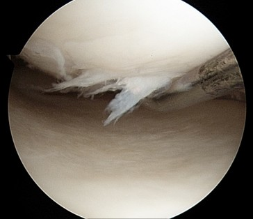

---
authors: [richard]
tags: [Algovera Freelance, Algovera Tournament,Data Science, Web3, Machine Learning, Startup, Ocean Protocol ]
--- 

### Algovera’s Mission

The mission of Algovera is to empower data scientists to work independently outside of centralised tech companies. We think this is preferable to the current status quo for two main reasons. <!--truncate-->Firstly, it gives data scientists more freedom to work on projects that really interest them and inspire their passion. We believe this will result in more individuals working on projects that are good for society. Imagine a world where the brightest minds worked to develop AI for healthcare, climate, privacy and democratised finance, rather than surveillance, ad clicks and attention engineering. Secondly, it means that data scientists can own what they create. We believe that ownership and the passive income generated by co-owned inventions and IP can help to further cement the security of the independent data scientist in the long term. That being said, finding the right balance of ownership and short-term security (e.g. in the form of salary) is a complex issue that is likely to vary across individuals. For this reason, we think it is important to provide a range of options for working independently, including:

1. Algovera Grants
2. Algovera Freelance
3. Algovera Tournaments

Last month, we announced the Algovera [Grants](https://docs.algovera.ai/blog/2021/12/23/introducing%20algovera%20ai%20x%20web3%20grants/) program and invited data scientists to submit proposals for their own project ideas that combine AI and Web3. We received a total of 15 (!) [proposals](https://twitter.com/AlgoveraAI/status/1484120331174301699) with a diverse range of projects that span computer vision, healthcare, climate, community/DAO tooling and token engineering studies. [Voting](https://poap.vote/poll/259) is currently underway (finishing at 23:59 on 26th January), and you can take part using an Algovera “Super Early Community” NFT that can be requested in the #support channel of our [Discord](https://discord.com/invite/e65RuHSDS5). Grants are a great option to enable data scientists with project ideas to start building independently. However, there are many data scientists who may want to gain experience by working on interesting projects in the form of freelance work and tournaments. With this in mind, Algovera is excited to announce our partnership with [nCight](https://www.ncight.com/) to develop a medical image classification algorithm on a private dataset of surgical images. This partnership will initially provide a freelance opportunity for up to two data scientists, as well as a small tournament for the rest of the data scientists in the Algovera community. These part-time opportunities are ideal for data scientists wanting to dip their toes into independent data science work, while continuing to work in their existing role. Interested data scientists should submit their interest by filling out the following application [form](https://airtable.com/shrM89bWBQ5I8FIfa).

### nCight’s Mission

nCight are building a network of independent orthopaedic surgeons, and empowering them by unlocking arthroscopic imaging data for sale to medical device companies. Independent physicians struggle with maintaining autonomy due to the negative reimbursement pressures from third party payors. For the first time in the history of the United States, the number of employed physicians outnumber independent physicians. Orthopaedic surgeons have been able to withstand consolidating pressures largely due to access to ancillary streams of revenue such as ambulatory surgery centres and owning PT and advanced imaging (e.g. MRI). Even with these additional streams of income the number of surgeons in private practice has declined by over 30% over the last 20 years. Independent physicians drive innovation and represent an important part of the healthcare system. It was independent surgeons that pioneered advances in pain management and anaesthesia to make outpatient procedures safe and cost effective, saving the healthcare system 100s of millions of dollars. There is therefore a public interest in keeping physicians independent. It is easy to see that the goals of Algovera and nCight are well aligned.

Arthroscopic image of a knee [[Reference](https://stanfordhealthcare.org/medical-treatments/k/knee-arthroscopy.html)].

### The Project

This [article](https://arxiv.org/abs/2001.06684) provides some background on how collaboration happens in data science projects. The development of useful machine learning software is quite different to traditional software development in many ways. One example is that the practice requires a larger number of stakeholders with different backgrounds collaborating to extract insights from data. This includes data scientists (who undertake technical activities such as data cleaning, feature extraction, data modelling and evaluation of results) as well as domain experts (who engage in activities such as data labelling and interpretation of results). Ultimately, collaboration between data scientists and domain experts (e.g. orthopaedic surgeons) is a hugely important factor to building useful applications. This is one of the big reasons that we are so excited about this project.

**Algorithm Development**

The aim of the project is to develop a proof of concept of a medical image classification algorithm. Algovera has been working with nCight to create a small labelled dataset of about 100 images of knee and shoulder surgeries. This dataset has been uploaded to the Ocean [marketplace](https://market.oceanprotocol.com/). In this case, the surgical images contain personal data, and a private dataset is used so that data scientists cannot directly download or view the majority of images (except for a small number of sample images). Instead, data scientists will need to write algorithms that travel over the network to the location of the data itself (called compute-to-data, C2D). The outputs, such as statistical results and trained machine learning models, are then returned to the data scientist. Working with marketplaces and private datasets is quite a different workflow than data scientists are used to, and this is the reason that we ran a series of hacking [sessions](https://www.youtube.com/watch?v=AThhcQrjRQk&list=PLgIrgqrkZC93qCxZFx_kWzk2vFdvgJjJI) to demonstrate the whole process (for a generative art algorithm). First, the data scientists can train and overfit a machine learning model locally on the sample data (e.g. in a notebook). This sample data will have the same format and interface as the overall dataset. Once confident that the training algorithm runs on the sample data, which has the same interface as the overall dataset, the data scientists will need to convert the algorithm to a format compatible with C2D, publish it to the Ocean marketplace and run it on the private dataset. Once satisfactory performance is achieved, the data scientists will write an algorithm to run inference of the pre-trained model and publish it to the marketplace. The Algovera core team will provide project management and supporting roles. All of the resulting code will be made available with an open source licence.

**Freelance**

The main component of the project is freelance work for one or two data scientists. The data scientists should be available 5 to 10 hours per week until the project finishes at the end of February. The total amount on offer for the freelance component is $1750 (1x $1750 or e.g. 2x $875) to be released upon completion of the deliverables. The data scientists will also receive a total of 18% of the ownership of the algorithm and any revenue it generates. Algovera DAO will recieve 7%, with the remaining amount transferred to nCight. Interested data scientists can submit their interest [here](https://airtable.com/shrM89bWBQ5I8FIfa) and comment on their preference to complete the entire project alone or collaborate with another data scientist. In the case where a team of data scientists works on the project, we will experiment with tracking contributions using some new tools. SourceCred can be used to track objective contributions like GitHub commits, while Coordinape can be used to track more subjective contributions. At all stages, we will communicate with and request feedback from the data scientists to ensure that the proposed rewards are fair.

**Tournament**

The secondary component of the project is a tournament open to all data scientists in the Algovera community. This group is free to use and adapt the open source code developed by the freelance data scientists, with a prize of $500 awarded for the model with the highest performance.

**Dates**

The following gives an outline of the important dates and deadlines for the project:

- 24th Jan ⇒ Register interest open to data scientists
- 30th Jan ⇒ Algovera core team selects 1 or 2 successful applicants
- 31st Jan - 2nd Feb ⇒ Intro meeting with applicants to outline process
- 3rd Feb ⇒ Freelance work begins
- 3rd Feb ⇒ Tournament begins
- 17th Feb ⇒ Freelance work finishes
- 19th Feb ⇒ Freelance reward released
- 24th Feb ⇒ Tournament finishes
- 26th Feb ⇒ Best model announcement
- 26th Feb ⇒ Algorithm published on main net and ownership distributed
- 26th Feb ⇒ Tournament reward released