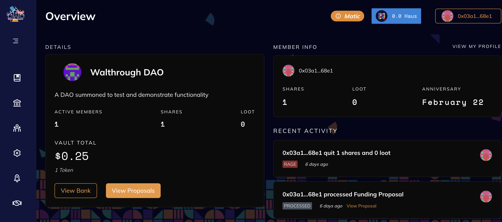

---
authors: [richard, hithesh]
tags: [Algovera Grants, Data Science, Web3, Machine Learning, Startup, Ocean Protocol, DAOHaus, DAO, Algovera Squads]
--- 

Recently, we [announced](https://docs.algovera.ai/blog/2021/12/23/Introducing%20Algovera%20AI%20x%20Web3%20Grants) the launch of Algovera Grants to fund projects that combine AI and Web3. <!--truncate--> We received some awesome proposals in Round 1, which you can read in [full](https://forum.algovera.ai/c/proposals/6) or in the form of short [summaries](https://twitter.com/AlgoveraAI/status/1484120331174301699). Our community voted and we [announced](https://docs.algovera.ai/blog/2022/01/27/Grant%20Recipients%20for%20Algovera%20Grants%20R1) the list of winners. We had initially planned to fund 5 proposals, but decided to fund a total of 8! These projects were to operate as independent AI teams (called Squads) within the Algovera ecosystem. Squads are intended to promote collaboration and transparency, and facilitate coordination and governance around assets and generated revenues. 

Since then, we have been maintaining close contact with the successful teams and aim to support and work closely with them to achieve their goals. We are pleased to announce that we have now spun up a [DAO](https://future.a16z.com/dao-canon/) for each of our Squads and completed the first round of payments. For each Squad, we also created a separate [page](https://www.notion.so/Squads-194768658a044302a0cdc24d5d758b9d) on our wiki that Squad members can edit. This also allows the Algovera community to keep up with progress. The knowledge base of Algovera will grow as Squads progress. Your success is our success! 

We initially planned to set up Squads with the Aragon DAO framework, as it had the nicest UX. However, we came across a bug with sending USDC to the DAO treasuries on the Polygon network. As a result, we decided to use [DAOHaus](https://daohaus.club/) to summon the DAOs instead. DAOhaus is a no-code platform for launching and running DAOs. It is owned and operated by the community. All DAOs on the platform utilize the glorious open-source code of [Moloch](https://daohaus.club/docs/users/intro-moloch).  We actually looked at using DAOhaus way back (even before Aragon) as it provides more functionality out of the box, but we were less impressed with the UX. The aim of this blog post is to provide Squads with a resource to navigate DAOhaus to complement our video walkthough [playlist](https://www.youtube.com/watch?v=nQ9NM9Wvv_c&list=PLgIrgqrkZC93kEGstDRdDExlToRjZVJHe) on our YouTube channel. We also request a few small action items from Squads, and provide some optional services from Algovera.

### DAO framework walkthrough

Here are the steps that Squads can take to become familiar with the platform:

1. First, go to the **DAOHaus** web [app](https://app.daohaus.club/) and log in with MetaMask (using the same wallet that you use to fill out the claims form for Algovera Grants). We have also registered each DAO (with metadata etc.) so that the Squads should be discoverable on DAOHaus. 
2. You should see your Squad DAO under **Polygon**. We summoned the DAOs on the Polygon network to save squad members from high transaction fees, which can discourage actions in the DAO. Navigate and select your Squad. 
3. Navigate to the **Proposals** panel. Proposals are the mechanism by which you can take actions such as moving funds, signalling interest, and adding or removing members. Proposals need to be approved by members. For more information, including how to approve and sponsor proposals, check out our governance walkthrough [video](https://www.youtube.com/watch?v=zM4zrelqX-w&list=PLgIrgqrkZC93kEGstDRdDExlToRjZVJHe&index=2). 
4. Navigate to the **Vaults** panel, where you can view the total assets held by the DAO. Each DAO uses USDC (on Polygon) as the primary token. You should have about 500 USDC in your safe. This is 50% of the total requested amount, with the remaining 50% paid upon completion of deliverables. 
5. Navigate to the **Members** panel, where you can check the active members of your Squad. You can also see the number of shares and loot. You should see that Algovera has 5 shares (or 5%), with the remaining 95 shares (or 95%) split between team members. 
6. Navigate to the **Settings** panel. This is the place where you can get more information about what it takes to make and process a proposal. We configured the DAOs to have a voting period of 2 days and a grace period of 1 day. The proposal deposit is set to 0.3 USDC and the proposal reward is set to 0.03 USDC. A short voting and grace period, combined with a low proposal deposit, allows Squad members to process proposals quickly and cheaply.
7. Navigate to the **Boosts** panel. Here you will find apps that can be added to the DAO. This is where we summoned a “[safe minion](https://daohaus.club/docs/users/minion-faq/#safe-minion)” (effectively, a [Gnosis Safe](https://gnosis-safe.io/) with the DAO as the sole owner). This is the address that we used to transfer the funds from the Algovera treasury. 
8. Navigate to the **Profile** panel. Here, you can see the activities that you’ve engaged in (i.e. proposals), as well as the amount of funds that you currently have within the DAO.

### A few small action items

When they get a chance, we also ask each Squad to complete the following actions:

1. Reach out to Richard on Discord with your GitHub username so that we can add you to the Algovera [Organization](https://github.com/AlgoveraAI). 
2. Once you’re added, create a GitHub repo under the Algovera Organization for your Squad. For an idea of what a good readme looks like, check out the Virtual Object Detector [repo](https://github.com/AlgoveraAI/squad-virtual-object-detector). 
3. Navigate to the wiki [page](https://www.notion.so/Squads-194768658a044302a0cdc24d5d758b9d) for your Squad and make sure that you have edit access. Update the page with a link to your GitHub repo and a link to your DAOHaus Squad. 

### Some available options

If interested, we also provide a few more options available to each Squad:

1. If you would like to post a short progress update in our weekly newsletter (sign up [here](http://eepurl.com/hSYfK5)), and our official [Twitter](https://twitter.com/AlgoveraAI) and [LinkedIn](https://www.linkedin.com/company/algovera) channels, reach out to Richard on Discord with the update. 
2. We just announced the opening of our headquarters in... the metaverse! We are experimenting with Gather.town to create a virtual space for the Algovera community. The hope is that virtual spaces can allow people to form stronger connections than Zoom calls. We intend to provide a workspace dedicated to Squads in the Algovera HQ. This will be reserved for Squad members to meet, chat and brainstorm. Who knows, you might run into the members of other Squads by the watercooler!
3. For support on publishing assets on Ocean (e.g. to meet deliverables), check out our hacking sessions for generative art ([notebooks](https://github.com/AlgoveraAI/generative-art/tree/main/notebooks) and [playlist](https://www.youtube.com/watch?v=AThhcQrjRQk&list=PLgIrgqrkZC93qCxZFx_kWzk2vFdvgJjJI)). If you need to create a Docker image with new dependencies for C2D, check out the guide [here](https://github.com/AlgoveraAI/algo_dockers). Reach out to Richard on Discord if you have any questions or issues. 

Got it? Cool! That was an update on progress with Algovera Squads and some next steps for successful teams. We strive for transparency with key processes and decisions at Algovera. We plan to continue to release blogs that explain these as we iterate, grow, and expand. If you’ve got some feedback for things that we can improve on, we would love to hear :)