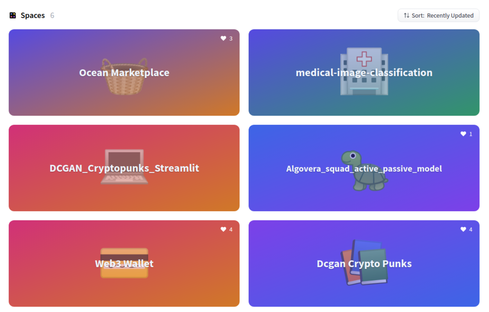
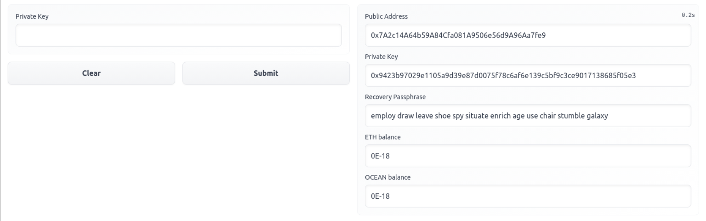
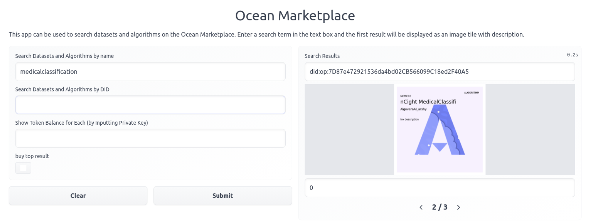
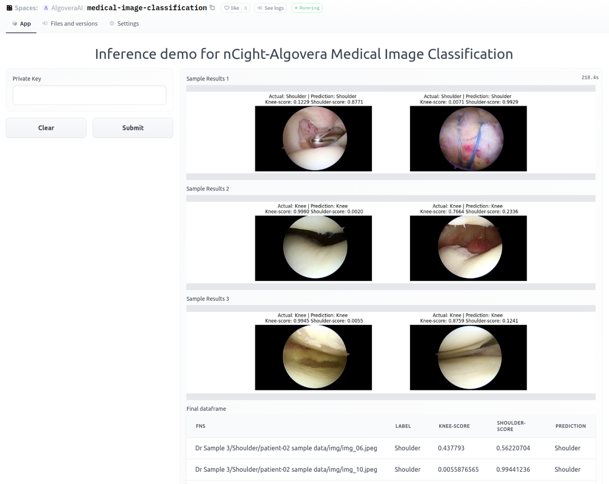

This tutorial will walk you through the steps to use Algovera token-gated apps on HuggingFace. All of our apps use the Ocean Protocol Python [library](https://github.com/oceanprotocol/ocean.py) in the backend. For more information on the benefits of token-gated assets and the benefits of integrating HuggingFace and Ocean Protocol, check out our blog [post](https://docs.algovera.ai/blog/2022/01/04/Using%20the%20Ocean%20Marketplace%20with%20HuggingFace%20Apps,%20Algorithms%20and%20Datasets).
<!--truncate-->

## Choose your app

Algovera has a growing collection of apps on HuggingFace Spaces (check out our organisation [here](https://huggingface.co/AlgoveraAI)). These include demos of algorithms created by our community, such as:

- 🎨 **DCGAN CryptoPunks:** A simple generative model pretrained on CryptoPunks. This algorithm was the output from a [series](https://www.youtube.com/watch?v=AThhcQrjRQk&list=PLgIrgqrkZC93qCxZFx_kWzk2vFdvgJjJI) of hacking sessions that took place over 8 weeks to explore how to build machine learning models using data marketplaces and privacy-preserving machine learning (PPML) techniques. You can read our thoughts about why PPML is useful for generative artists [here](https://docs.algovera.ai/blog/2021/12/07/Unlocking%20more%20value%20for%20NFT%20enthusiasts%20by%20bringing%20access%20to%20generative%20art%20algorithms%20on-chain).
- 🏥 **Medical Image Classification:** A simple algorithm that classifies knees and shoulders from arthroscopic images. This was the result of a [partnership](https://docs.algovera.ai/blog/2022/01/24/Announcing%20Algovera%E2%80%99s%20Partnership%20with%20nCight%20to%20develop%20a%20medical%20image%20classification%20algorithm) with a group of orthopaedic surgeons who provided the data.

Keep an eye out for an algorithms that are coming soon:

- 💸 **Borrowing Cost Prediction:** This is a time series model that predicts the cost of borrowing from popular DeFi protocols. This means that users can save money when taking out loans.
- 🧠 **EEG Classification:** This a time series model that classifies eyes open and closed from EEG data. This was created during a recent [hackathon](https://www.notion.so/AlgoLYNXathon-Sign-Up-b2362fb5ac28462aaaba0d502cbe89ab) that brought together our community of data scientists with [neuroscientists](https://www.phas3.io/lynx).
- 💡 **Algovera Squads:** We recently funded a total of 8 teams in our first round of [grants](https://docs.algovera.ai/blog/2021/12/23/Introducing%20Algovera%20AI%20x%20Web3%20Grants) for projects that combine data science and Web3. These projects are making good progress and we hope to create demos for the developments soon.

If you’re interested in continuing to develop any of these applications, make sure to drop into the 🎨-generative-art, 🏥-healthcare, 💸-financial or 🧠-neuroscience channels or our [Discord](https://discord.com/invite/e65RuHSDS5). If you have an idea for an app, consider applying for our second round of grants 💡 to be announced in the coming days.

Our collection of apps also include utilities to help you to run the demo apps, such as the 💳 Web3 Wallet and 🧺 Marketplace apps. We expand on how to use these below.

## Create a Wallet

All of our datasets, algorithms and apps are token-gated. For more information on the benefits of token-gated assets, check out our blog [post](https://docs.algovera.ai/blog/2022/01/04/Using%20the%20Ocean%20Marketplace%20with%20HuggingFace%20Apps,%20Algorithms%20and%20Datasets). To obtain tokens to run an app, you will first need a wallet. If you plan to use your wallet only on the HuggingFace platform, you can use our Web3 Wallet [app](https://huggingface.co/spaces/AlgoveraAI/web3-wallet) on Spaces. To create a new wallet, leave the input field empty and press “Submit”. The app will then output a number of values, similar to those shown in the image below. If you want to also use a wallet outside of HuggingFace, you can also install a wallet for your browser (e.g. MetaMask, tutorial [here](https://docs.oceanprotocol.com/tutorials/metamask-setup/)) and export your private key.

What do these values mean? Very briefly, a wallet consists of a public and private key. You can think of the public key like your email address and the private key like your password. The public key can be easily determined from the private key, but not vice versa. The private key is output in the form of both a hexadecimal number and the corresponding mnemonic phrase, which is easier to remember. If you want to continue to use the same wallet in future (e.g. to run another app on HuggingFace Spaces), you should store the private key (and/or the mnemonic phrase, which can be used to recover the private key). For example, you can run our other apps on HuggingFace Spaces by entering the private key to the input field. You shouldn’t give your private key to anyone ever. In fact, it is bad practice to store your private key on your PC for wallets that contain tokens with real value. However, we are using test tokens on an Ethereum test network (Rinkeby) where the tokens have no real value. We are working on better ways of authenticating (e.g. creating Streamlit apps where you can log in with MetaMask).

Initially, your wallet should have no ETH and OCEAN tokens in it. You can request ETH and OCEAN test tokens by entering your public address into faucets (ETH [faucet](https://faucet.rinkeby.io/) and OCEAN [faucet](https://faucet.rinkeby.oceanprotocol.com/)). Then wait a minute and re-run the app by entering the same private key in the input field. If you are having issues, feel free to reach out in the Algovera [Discord](https://discord.com/invite/e65RuHSDS5) and someone will send you some tokens. You can think of ETH and OCEAN as currencies for paying transaction fees and buying access tokens for datasets and algorithms.

## Acquire Access Tokens on the Marketplace

Now that we have a wallet, we can use the Marketplace [app](https://huggingface.co/spaces/AlgoveraAI/ocean-marketplace) to acquire tokens to run the demo apps that we are interested in. Let’s take the Medical Image Classification app as an example. To run this demo app, you need to make sure that you have bought tokens for both the algorithm and the dataset. We can search using either a term or a decentralized identifier (DID) value. For example, try searching for the term “medicalclassification”. The results of the search will be shown on the right hand side. You can navigate between search results with the arrows. Navigate to the asset with a DID given by “did:op:7D87e472921536da4bd02CB566099C18ed2F40A5”. This is the algorithm that is used by the app. Also shown just above the arrows is the number of access tokens that you possess for this asset. If you didn’t enter your private key to the input field, this will show zero. We can buy this asset by checking the “buy top result” box. We also need to enter the DID in the “Search Datasets and Algorithms by DID” field to ensure that this algorithm is the top result. Finally, you need to enter your private key. Give it some time to run, and it should display a token balance increased by one. You need to repeat this procedure to buy the data asset e.g. enter the DID “did:op:62D5Db3778ABAABa808e53eB2AB28181aaCCF747”, your private key and check the box to buy. If you prefer to use a browser wallet, you can also buy the tokens on the Ocean [marketplace](https://market.oceanprotocol.com/) app. The algorithm asset can be found [here](https://market.oceanprotocol.com/asset/did:op:7D87e472921536da4bd02CB566099C18ed2F40A5) and the data asset [here](https://market.oceanprotocol.com/asset/did:op:62D5Db3778ABAABa808e53eB2AB28181aaCCF747).

## Run the Demo App

Now, we are ready to run the demo [app](https://huggingface.co/spaces/AlgoveraAI/medical-image-classification) for medical image classification on the public sample data. Just enter your private key and press “Submit”. It will take a few minutes to run, before showing the classification results.

## Video Tutorial
To view the video tutorial of this blog, click the following link: 

## Join our community

Algovera is a community of data scientists, domain experts, software developers and other stakeholders. The workflow and practices for data science become quite different with recently-maturing technologies such as private AI, data marketplaces and Web3.  Our goal is to build tools that make it easier to create and maintain ownership of AI apps.

Drop into our [Discord](https://discord.gg/e65RuHSDS5). Read the manifesto on our [Website](https://www.algovera.ai/). Find more resources on our [Notion](https://algovera.notion.site/). Check out our videos on [YouTube](https://www.youtube.com/channel/UC2A5iUpP6k52ZZmC8LFj1IA). Contribute to our [GitHub](https://github.com/AlgoveraAI).