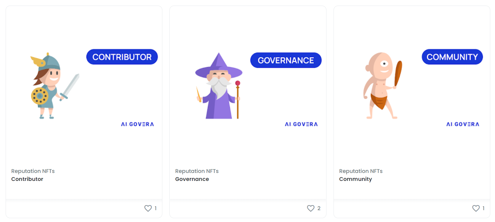

---
authors: [keaton]
tags: [Algovera Grants, Startup, Reputation, Algovera Squads]
--- 

As we continue to refine and improve internal processes at Algovera, we have begun to leverage the power and flexibility of NFTs to improve our Grant voting process. The Algovera Reputation NFT collection is meant to facilitate voting in Algovera Grants Round 2, where each NFT will award voting power to community members based on the criteria listed below. The collection has been minted on Polygon and are available on OpenSea, check them out [here](https://opensea.io/collection/reputation-nfts)!

<!--truncate-->

Algovera Reputation NFTs are meant to broadly capture the amount of activity and value that community members have produced in the Community, particularly over the last calendar month. Votes will be hosted on Snapshot through a custom Algovera space to allow for gas-less voting based on on-chain assets.

That being said, it’s definitely worth mentioning that the Algovera Reputation system is still currently being developed. The Reputation NFTs released for Round 2 Grant voting are intended to be an approximation of value and activity generated. If you’re interested in working with us on codifying the Algovera Reputation system you can apply to join the Reputation pod by filling out this [form](https://airtable.com/shrAd3x6fNLAyZJiK).

Algovera Reputation NFTs will be released in three tiers:

1.) **Community Member** - Any community member who has added their information to the Community Directory using the form below will receive the Community Member NFT and will be eligible to vote in Round 2 Grant funding. You can add your information to the community directory [here](https://airtable.com/shrQPjhE9wxHbWKL2)!

2.) **Contributor** - Any community Member who has generated a Cred Score above 10 or is a member of a current Pod or Squad will receive the Contributor NFT.  Cred Scores are calculated using default weights in SourceCred, and you can view the Algovera SourceCred graph [here](https://cred.algovera.ai/#/explorer).  We are constantly exploring ways to more accurately leverage SourceCred, so if you don’t think SourceCred is accurately representing your contributions please contact us in Discord and we can help troubleshoot!

3.) **Governance Participant** - Any contributor who engaged in governance for Round 1 voting will receive the Governance Participant NFT. The goal of this tier of NFT is to reward and incentivize community members to participate in governance actions like voting for grants!

To claim any of the above tokens, please reach out to Hithesh on Discord - **Hithesh | Algovera.ai#4001**

Round 2 voting will be held on Snapshot and will award voting power based on which NFTs each community member holds. Each community member is eligible to hold multiple NFTs (i.e. Contributor and Governance Participant) and will be able to leverage that voting power accordingly.

As always, we are working to create tools and workflows that work best for the community and are actively making adjustments to our processes based on feedback. Please don’t hesitate to reach out to the core team on discord if you have any questions or suggestions!

