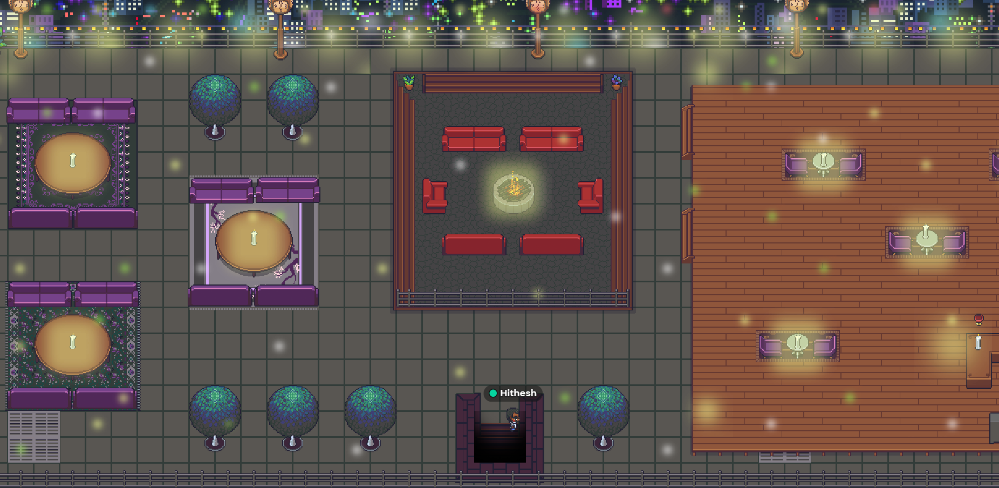

---
authors: [keaton, richard, hithesh]
tags: [Algovera Grants, Startup, Demo Day, Algovera Squads]
--- 

Algovera is a maturing ecosystem of independent AI teams. So far, we have completed two rounds of grant funding, which attracted a total of nineteen proposals. Twelve out of the nineteen proposals received funding. Squads have made some exciting progress over the last few months with few projects are reaching the stage where they are starting to apply for larger funding programmes. For example, the Virtual Object Detector Squad is [applying](https://port.oceanprotocol.com/t/unity-to-ocean-uploader-unity-implementation-ocean-marketplace-round-17/1813) for OceanDAO funding, the DeFi Squad has a working app ([video](https://www.loom.com/share/e3cb29c25b834f11871a620678a3c5d9) demo, [code](https://github.com/VintageGold/DeepDefiApp)) and the Healthcare Squad produced a first draft at a whitepaper.

<!--truncate-->

To showcase the amazing projects that members of the community have been working on, Algovera will be hosting it’s first Demo Day in a custom space in [Algovera HQ in gather.town](https://app.gather.town/app/6q5cie3Lb1W5RMwN/Algovera%20HQ). Demo Day will be open to anyone in the community, as well as outside guests upon invitation. We will be inviting investors and industry experts so that you can connect with investors and potential contributors for your project. Demo Day will consist of 5-8 minute presentations from each Squad showcasing their work, preferably with live demonstrations of working code. The Algovera Core Team will provide support for presentation preparation and code review prior to delivering the demonstration, along with supporting documentation outlining best practices and ideal presentation formats. After presentations, we hope to breakout into smaller groups to give the opportunity for questions and networking. The current planned data for Demo Day is just after finishing Algovera Grants Round 4. We truly can’t wait to see everyone’s amazing work!

Algovera Squads are funded through the [Algovera Grants Program](https://docs.algovera.ai/blog/2021/12/23/Introducing%20Algovera%20AI%20x%20Web3%20Grants), and have been building projects ranging from [medical image classification models](https://github.com/AlgoveraAI/freelance-medical-image-classification), to [DeFi borrowing rate prediction algorithms](https://github.com/AlgoveraAI/DeFi-borrowing-cost-prediction). If you are interested in joining an existing Squad or starting your own project, the [Algovera Tracks](https://docs.algovera.ai/docs/Tracks/Introduction) provide step-by-step actions to get started. Finally, you can check out a list of [current Algovera Squads here!](https://www.notion.so/Squads-194768658a044302a0cdc24d5d758b9d)

Additional details will be posted in follow up blog posts, as well as in Discord. **If you are a current Squad Member and have questions about Demo Day**, please reach out to KeatonK | [Algovera.ai#6787](notion://www.notion.so/algovera/Algovera.ai#6787) in Discord for assistance!
