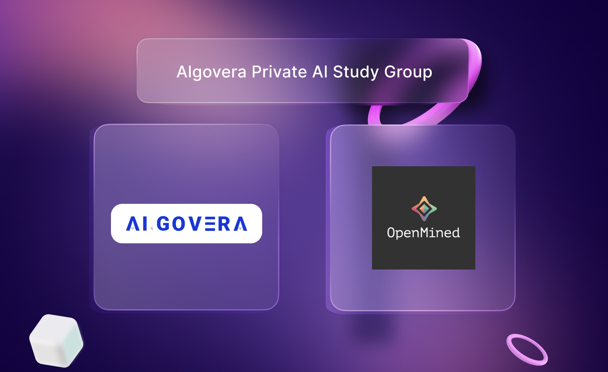

**Which course?** Openmined’s [Foundation of Private Computation](https://courses.openmined.org/courses/foundations-of-private-computation)

## About the course

“Become a data scientist and statistician capable of studying data you do not own and cannot see. Learn every major privacy-preserving technique to an intermediate level, understand how they work together, and how you can use them to safely study data owned by another organization (such as another university, enterprise, or government) without ever seeing the underlying data yourself.”

<!--truncate-->

**When?** Last Thursday of each month (schedule below) @ **2:00pm UTC**

## Topics & Schedule

| Date                | Topics                                                                                                 |
|---------------------|--------------------------------------------------------------------------------------------------------|
| 26th May 2022       | 1. Federated Learning \| 2. Split Learning                                                             |
| 30th June 2022      | 1. Cryptographic Ciphers \| 2. Modular Algebra                                                         |
| 28th July 2022      | 1. Towards Practical Cryptography \| 2. Block Ciphers, and the Advanced Encryption Standard            |
| 25th August 2022    | 1. Asymmetric Cryptographic Systems \|  2. Homomorphic Encryption                                      |
| 29th September 2022 | 1. Secure Multi-Party Computation \|  2. Public Key Infrastructure \|  3. Private Set Intersection \|  |
| 27th October 2022   | 1. Project demo day \|  2. what’s next discussion                                                      |

**Where?** [Algovera’s HQ](https://app.gather.town/app/6q5cie3Lb1W5RMwN/Algovera%20HQ)

**What is the format for the study group?**

- Watch the corresponding video lectures at our own pace before each session
- During the session, we will start with the corresponding coding exercise
- Followed by a discussion on the concepts

**What is project demo day?**

- Members will work on a small project to show what they have learned with the community
- Details will be decided by the study-group members

**What happens after the study group?**

- We can continue with the next course offered by Openmined
- Or choose another course on Private AI
- Or work on a project together

## Register Interest
Use this [link](https://airtable.com/shrM5Tz5vZbpgK8Rv) to submit your interest in joining the study group before **13/05/2022**.  