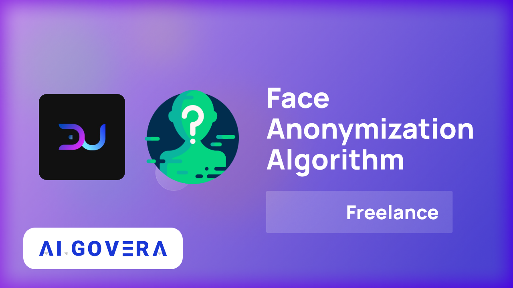

---
authors: [richard]
tags: [Algovera Freelance, Data Science, Web3, Machine Learning, Crowdsourcing, Fairness, Ocean Protocol]
--- 

The mission of Algovera is to empower data scientists to work independently and keep ownership of what they create. We are passionate about creating AI apps that are oriented to the needs and preferences of the user rather than the corporation. For this reason, we are very excited to announce our partnership with DataUnion to improve the performance of face anonymization algorithms across different ages, ethnicities, and genders. In particular, this project will explore a novel approach to creating AI apps that are more fair, unbiased, and collectively owned by users and creators, using the advantages of networks, crowdsourcing and Web3. You can can find information on this new approach and why we think it’s important below.  We are currently looking for freelance data scientists to work with us on this project, and you can submit your application using this [form](https://airtable.com/shrM89bWBQ5I8FIfa). 
<!--truncate-->

### How does machine learning/computer vision work?

The aim is to learn a mapping from an input (an image in this case) to a target label of interest (the detected face to be anonymized). To train the algorithm, we need to collect a dataset of input-target pairs. We pass the inputs to the algorithm, e.g. one by one, and tune the many weights of the algorithm until the outputs generally match the target labels for each training sample. If we have done this well, hopefully the algorithm will generalise to unseen samples.

### **How is a dataset usually created?**

Typically, a dataset of images of faces would be collected in house by the company creating the model.  The images are then labelled by human annotators. This might also happen in house, or be outsourced to another company or a platform like Amazon Mechanical Turk. A machine learning model is then trained on this dataset. Once the performance of the algorithm is “good enough”, it is deployed to the real world using an app that allows users to interact with the machine learning algorithm. What we typically see is that the performance drops significantly on deployment. The reason for this is that the in-house dataset that the model was trained on has a different distribution to the data observed in the real world. For example, the in-house dataset may have been collected in just a few countries with the subjects representing a small subset of ages, ethnicities and genders. The performance drop during deployment is a big and well-known issue and has a high expense for AI companies.

### How can we improve this?

DataUnion creates data unions to crowdsource datasets and give ownership to the data creators, annotators and verifiers. With Web3, we can incentivize data providers to contribute data from all over the world before we have a working product. This means that the dataset used for algorithm training can better represent the real-world distribution from the outset. This has huge advantages in terms of bias and fairness. Furthermore, the issue of performance dropping on deployment can be mitigated. 

### How will this project move in this direction?

The ultimate aim of the project is to retrain existing face detectors to improve their performance across different ages, ethnicities, and genders. The first step is to evaluate the performance of existing face detectors on a range of datasets. For example, we will start with the [Open Images Dataset](https://paperswithcode.com/dataset/open-images-v4) of approximately 9 million images with annotations, which is widely accepted as an important dataset to measure and advance the state of the art in image and scene understanding. We will then work towards evaluating on a new set of annotations to this collection called [MIAP (More Inclusive Annotations for People)](https://paperswithcode.com/dataset/miap), created to enable fairness analysis. Later, we plan to retrain existing models on images crowdsourced through DataUnion’s platform. We can then re-evaluate the performance on the same benchmarks, and analyse any improvement in face detection results with varying age, ethnicity, gender. Eventually, we will publish training and inference algorithms on the Ocean [marketplace](https://market.oceanprotocol.com/), that can be run using compute-to-data (C2D). 

### Who is DataUnion?

DataUnion creates data unions to crowdsource datasets and give ownership to the data creators, annotators and verifiers. Unlike platforms like Amazon Mechanical Turk where contributors are paid a small amount per image, DataUnion instead gives contributors the option to co-own the machine-learning-ready dataset. Distributing ownership of a dataset among creators prevents one centralised party from controlling it. In this framework, the value of any algorithms built on top of the dataset can flow back to the community rather than a single entity. Furthermore, the algorithms themselves (or maybe even the apps built on top) can be owned by the community.

### Who is Algovera?

Algovera is a community of independent AI teams creating useful AI applications. Our mission is to empower data scientists to work for themselves and keep ownership of (and monetize) their creations. We provide infrastructure that makes it easier to get from idea to an AI app deployed in the real world. We also provide opportunities for undertaking [freelance](https://docs.algovera.ai/blog/2022/01/24/Announcing%20Algovera%E2%80%99s%20Partnership%20with%20nCight%20to%20develop%20a%20medical%20image%20classification%20algorithm) work, applying for project [grants](https://docs.algovera.ai/blog/2021/12/23/Introducing%20Algovera%20AI%20x%20Web3%20Grants) and taking part in [hackathons](https://mirror.xyz/0x8b2622EEA6ca1cD84423a63DD551bAC913BAc932/Lk1S-PD3eEfxttwYFrD4yOZNmidZJzMY1kQpYEewv7Q). Join our [Discord](https://discord.com/invite/e65RuHSDS5) to find out more. 