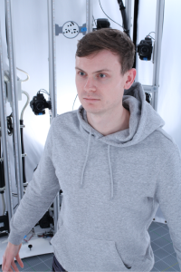

## Event Information

**Session Title**

Decentralized AI Infrastructure for Scientific Research in Autonomous Communities

**Organizers**
Shady (OpSci), Richard (Algovera)

**Session Date**
May 24th, 10am - 1130am CET

**Session Theme**

Access to the tools and resources required for studying human society, the natural world, and our collective impact on it, have been traditionally limited to those with privileged access. Currently, a fresh wave of data is being onboarded to a new open source infrastructure, opening up vast new opportunities for secondary use-cases. Digital communities all around the world can now access massive volumes of data and collaborate in real time, increasing the collective throughput of scientific research and development of real-world applications. Raw data has latent value that requires processing to extract insights and enable useful predictions, e.g. using machine learning and AI. However, this is a complex process involving many steps and moving parts. Decentralization offers potential benefits, but development of the underlying infrastructure is early-stage and fragmented. Key bottlenecks include access to compute and storage resources, tools for transparency and governance, and limitations of current intellectual property. In this session, we explore current developments in decentralized AI infrastructure, such as decentralized web storage, accessible compute markets, decentralized autonomous research communities, and knowledge artifacts as synthetic non-fungible assets - with a particular focus on open science communities.

## Session Participants

### **(1) Composable DeSci Flows Via Token-Wrapped Data & Algorithms** (Trent McConaghy, Ocean Protocol)

**Bio:** *Trent McConaghy co-founded Ocean Protocol. He has worked on AI since 1997 (circuit synthesis, statistical verification), and blockchain since 2013 (incl. Token Engineering, agent-based simulation, and Ocean). He holds a PhD in EE. He's written two textbooks and 40+ peer-reviewed papers and patents.*

**Talk Abstract:** *Science is about making models to predict unseen events, in a reproducible way. It's data all the way down. Data can be raw measurements, cleaned data, features, scientific models, or predictions. Data can be algorithms to build the models. Data can be dynamically changing.*

*This talk describes how to use Ocean for composable, reproducible data flows by tokenizing data & algorithms: ERC721 data NFTs to wrap the base data/algorithms, and ERC20 datatokens as access control tokens. Compute-to-Data flows preserve privacy and control. Data & algorithms can use Web3 storage or compute.*

*Data NFTs and datatokens are the atomic building blocks. They naturally interoperate with Web3 wallets, DAOs, DEXes, and other Web3 tools. From this, we can construct many DeSci flows, from AI-training provenance to scientific model commons to algorithm marketplaces.*

### (2) **Compute over Data** (David Aronchik, Protocol Labs)

**Bio:** *David Aronchik is the Lead of Research Development at Protocol Labs, helping, deploying and organizing our community building the next generation of the Internet. Previously, David led Open Source Machine Learning Strategy at Azure, product management for Kubernetes on behalf of Google, launched Google Kubernetes Engine, and co-founded the Kubeflow project and the SAME project. He has also worked at Microsoft, Amazon and Chef and co-founded three startups.*

### (3) **Decentralized Infrastructure for Science (**Christopher Hill, DeSci Labs)

**Bio:** *Dr. Christopher Hill is a co-founder of DeSci Labs. Chris is an interdisciplinary scientist who worked at the crossroads of neuroscience, economics, and machine learning. He holds a PhD in Neuroeconomics.*

**Talk Abstract:** *Together, Protocol Labs and DeSci Labs are democratizing access to scientific infrastructure by creating technologies to promote reproducibility, replicability, and recalibrate the incentives to produce and verify new knowledge. The ability to run compute, whether for data processing or serving (e.g. microservices) is a major missing piece of the DeSci stack. By enabling spare compute power globally to be contributed to an open market of providers and scientists, the cost of compute can become accessible to all scientists, promoting global knowledge sharing.*

### **(4) Decentralized AI for Planetary Regeneration** **(**Rafael Kaufmann, Digital Gaia)

**Bio:** *Raf is a technologist with experience encompassing physics, economics, AI, statistical and complex systems modeling, product management, entrepreneurship, and organizational development. After 6 years learning about collective intelligence and applying it to scale organizational effectiveness at Google, he co-founded Digital Gaia with the mission of building Earth's neocortex.*

**Talk Abstract:** *We are building prosthetic brains for ecosystems to support and automate decision-making in impact investment. We will give an overview of the technical architecture and network incentives, and highlight some interesting design considerations.*

### **(5) The Decentralized AI Stack** (Richard Blythman, Algovera)

**Bio:** *Richard is a machine learning engineer with a research background. He co-founded Algovera to tackle issues he experienced in big tech, universities and startups around applications, funding, and the time taken to develop AI apps.*

**Talk Abstract:** *The AI stack has many components that need to come together for building useful applications, including storage, compute, marketplaces, access control, funding and organizational structure. We will outline some of the work that Algovera has been doing to decentralize and integrate various layers of the stack, as well as some of the applications being developed in our ecosystem of independent AI teams.*

## Who is Algovera?

Algovera is a community of independent AI teams creating useful AI applications. Our mission is to empower data scientists to work for themselves and keep ownership of (and monetize) their creations. We provide infrastructure that makes it easier to get from idea to an AI app deployed in the real world. We also provide opportunities for undertaking [freelance](https://docs.algovera.ai/blog/2022/01/24/Announcing%20Algovera%E2%80%99s%20Partnership%20with%20nCight%20to%20develop%20a%20medical%20image%20classification%20algorithm) work, applying for project [grants](https://docs.algovera.ai/blog/2021/12/23/Introducing%20Algovera%20AI%20x%20Web3%20Grants) and taking part in [hackathons](https://mirror.xyz/0x8b2622EEA6ca1cD84423a63DD551bAC913BAc932/Lk1S-PD3eEfxttwYFrD4yOZNmidZJzMY1kQpYEewv7Q). Join our [Discord](https://discord.com/invite/e65RuHSDS5) to find out more. 