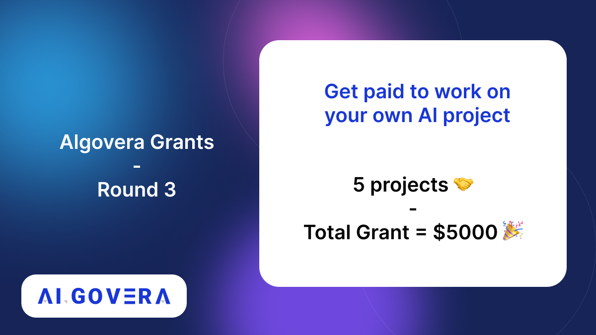

---
authors: [keaton]
tags: [Algovera Grants, Data Science, Web3, Machine Learning, Hackathon, Algovera Squads]
--- 
_We are back with another grants round! The Algovera community has continued to produce incredible projects, and we are excited to continue funding innovation in decentralized AI with Round 3 of our Grants program. Read on for details and summaries of previous grant winners!_

<!--truncate-->

Algovera Grants Round 2 saw several returning projects with incredible promise - such as the [DeepDefi project](https://deepdefi.algovera.ai/) as well as several promising new projects like [Wat.to - Smart NFT Search](https://www.wat.to/). You can see our list of current Squads [here](https://www.notion.so/Squads-194768658a044302a0cdc24d5d758b9d).

We will award **$5000 USDC** in grants to 5 separate projects within the community. *As a reminder -* Squads who have received funding in previous rounds will need to demonstrate that all deliverables listed on their previous proposal have been completed. This means existing Squad members who are looking to apply for funding in Round 3 need to have received the full amount of their Round 2 grant by confirming that previous deliverables have been met. If you’re a member of an existing Squad and need any help determining the status of your Round 1 deliverables, or just need help navigating this rounds' application process, please reach out to the Core Team on Discord! 

The previous round of voting using Algovera Reputation NFTs was successful, so we'll be using the same approach this time! As a refresher, there are three categories of reputation NFTs:

1.) **Community Member** - Any community member who has added their information to the Community Directory using the form below will receive the original Community Member NFT and will be eligible to vote in Round 3 Grant funding. Additionally, anyone who received praise through our praise system will receive the second edition of Community NFTs. You can add your information to the community directory [here](https://airtable.com/shr1jPNvcbd3ElEll), and you can reach out to KeatonK | Algovera.ai#6787 on Discord if you think you should have received the second community NFT for praise but do not see it in your wallet!

2.) **Contributor** - Any community Member who has generated a Cred Score above 10 or is a member of a current Pod or Squad will receive the Contributor NFT. Cred Scores are calculated using default weights in SourceCred, and you can view the Algovera SourceCred graph here. We are constantly exploring ways to more accurately leverage SourceCred, so if you don’t think SourceCred is accurately representing your contributions please contact us in Discord and we can help troubleshoot!

3.) **Governance Participant** - Any contributor who engaged in governance for previous voting rounds will receive the Governance Participant NFT. The goal of this tier of NFT is to reward and incentivize community members to participate in governance actions like voting for grants!

We will be sending out Governance and Contributor NFTs for folks who now meet the criteria next week! If you believe you should have any of the above NFTS in your wallet from previous rounds and you currently do not, please reach out to KeatonK | Algovera.ai#6787 on Discord for assistance!

You can also read our [introductory blog post on Reputation NFTs here](https://docs.algovera.ai/blog/2022/04/13/Introducing%20Algovera%20Reputation%20NFTs).

**Submission and Discussion Process**

The first step is to write up a proposal for your idea (about one A4 page) following [this](https://forum.algovera.ai/t/grant-proposal-template/15) template. As a rough guideline, the deliverables might be designed to be achievable in one month of part-time work. The proposal should be posted to the Algovera Discourse forum under the [Proposals](https://forum.algovera.ai/c/proposals) category before the proposal deadline (June 15th at 23:59 GMT). There are subcategories for each round, so you can view previous and current proposal using [this view](https://forum.algovera.ai/c/proposals/round-3/10). There will be a follow up period for community feedback and discussion. This should take place primarily in the comments sections of the project posts in the forum. 

Algovera Squads continue to push the boundaries of innovation in decentralized AI, and we hope to continue supporting their work with Algovera Grants Round 3!

The following are the provisional dates for Round 2 of Algovera Grants:
- 1st of June - 15th of June = Application Open & Claim Reputation NFTs (votes)
- 16th of June - 28th of June = Review & Feedback on Applications
- 30th of June - 05th of July = Voting Period
- 06th of July = Announce Winners
