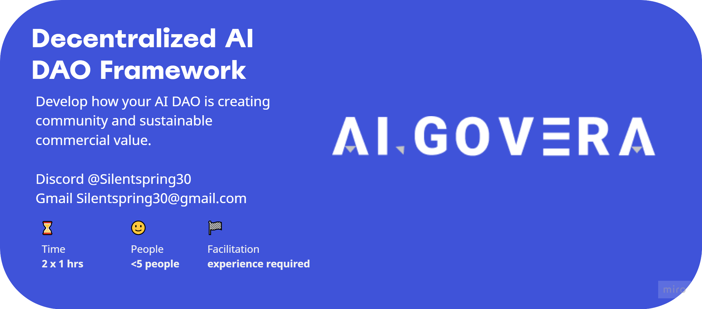

---
authors: [silent]
tags: [Decentralized AI, Workshop, Design Thinking, Squads]
--- 
_TLDR: [Algovera’s decentralized AI DAO framework (DAID)](https://miro.com/app/board/uXjVOvsD0uc=/?share_link_id=948533770979) will accelerate your journey from AI project to a decentralized-AI DAO. It covers how to set up sustainable monetization options for your datasets and AI models to marketplaces, to tools for decentralized AI and even how to set up DAO community._

<!--truncate-->

Excited about starting your AI project?

- Apply for the Algovera 3rd grant rounds round, [here](https://docs.algovera.ai/blog/2022/05/31/Announcing%20Algovera%20Grants%20Round%203)
- Join Algovera’s **DAID** workshops, [sign up here](https://wuz5dw73wlf.typeform.com/to/TN9m4kFX)
- Ask us questions on [Discord](https://discord.gg/Jc2kSP5h)

Imagine running and funding your own decentralized AI-model project, making your choices in data, AI training and creating positive impact to many communities! And eventually becoming your own sovereign AI-driven DAO.

Trying to decentralize AI development from Tech giants or Military who currently dictate which AI projects get funded, is not a simple task. 

This is why, we at Algovera have developed a decentralized AI DAO Framework to help you to reach your goals faster. 

**DAID framework** consist of 4 key areas:

1. Design Thinking: who is the user and who is impacted by my AI model?
2. Decentralized AI tools: from data sourcing, storage, training, deploy to publishing AI models to market places
3. Creating sustainable commercial value
4. Web3 for decentralized AI teams: covers how to set up a DAO, governance, proposals, treasury management and member protection

**DAID Workshop:**

Format: Faciliated online workshop

Time: 2x 1hours

[Sign up here](https://wuz5dw73wlf.typeform.com/to/TN9m4kFX)

We are excited to see you. Any questions please reach out on [Discord](https://discord.gg/Jc2kSP5h)