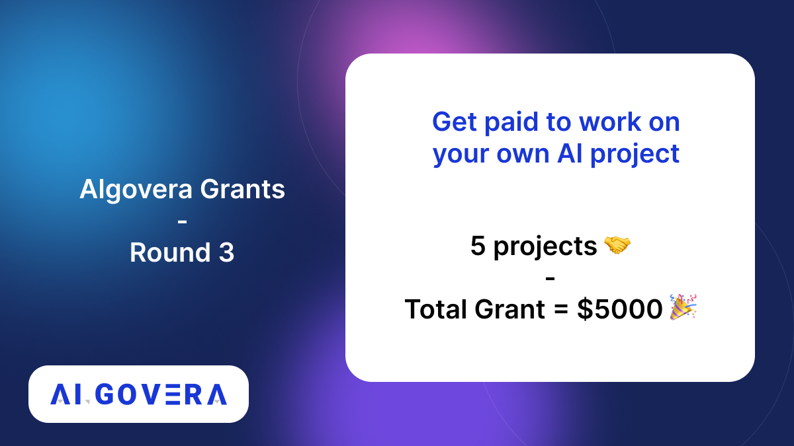

---
authors: [keaton]
tags: [Decentralized AI, Algovera Grants, Grant Winners, Squads]
--- 
#
Congratulations to the Algovera Grant Round 3 Winners!

Community voting has been completed for the third round of the Algovera Grants Program! 

<!--truncate-->

As the Algovera community continues to grow, we are seeing an increasing number of innovative and creative projects apply for funding, and this round we are excited to announce that we will be funding all six grant applicants!

We will be welcoming three new Squads to the creator community, as well as welcoming back three returning Squads. Check out a brief description of the projects and their proposal links below:

**[Decentralized Recommendation Engine](https://forum.algovera.ai/t/building-web3-social-media-based-recommendation-system-curriculum-toolbox/87)** by **@Dhruv**: Decentralized recommender systems using Web3-based profile and content prediction

**[Compass Labs](https://forum.algovera.ai/t/compass-labs-automating-decision-making-for-decentralised-markets/83/5)** by **@elisabeth** and **@09tangriro**: Automated decision-making tools for decentralised markets on the blockchain

**[Project Alan](https://forum.algovera.ai/t/project-alan-a-new-neural-network-architecture/80)** by **@Joshua Finn Keeler**: A novel neural network architecture based on the fundamental information flows of the human brain

In addition to the new Squads joining us, three returning squads have also received another round of funding:

**[DeepDefi](https://forum.algovera.ai/t/predictive-model-for-borrowing-cost-earnings-gained-from-popular-defi-protocols/88)** by **@Vintage Gold**: Predictive models for borrowing cost and supply earnings of popular DeFi protocols

**[Wat.to](https://forum.algovera.ai/t/wat-to-smart-nft-search-round-2/81)** by **@hal**: Smart search NFTs using natural language processing models

**[Project Themistoklis](https://forum.algovera.ai/t/project-themistoklis/78)** by **@alextoti**: Computer vision models for drones for fighting climate change and increasing food security

Stay tuned for further information regarding [Algovera Demo Day](https://docs.algovera.ai/blog/2022/05/03/Announcing%20Algovera%20Demo%20Day), where we will be showcasing the incredible work Algovera Squads have completed so far.

If you are interested in joining an existing Squad and getting paid to work, please fill out our [Squad Interest Form](https://airtable.com/shrQPgy3zzubol64D) and we’ll help you find a Squad that fits your interests!