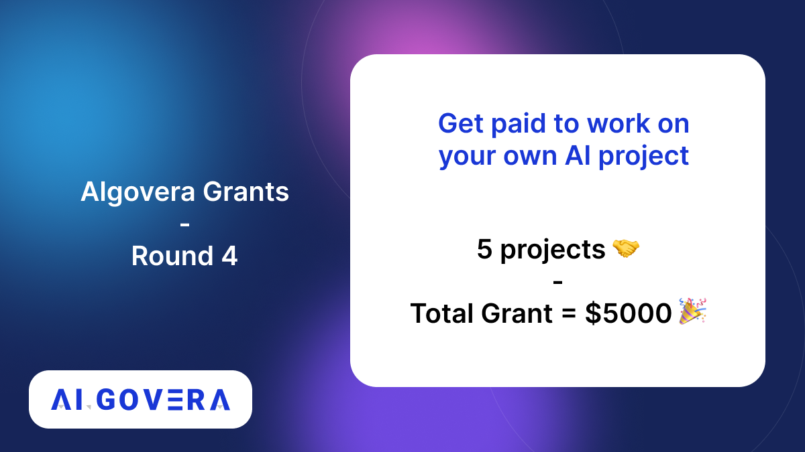

---
authors: [keaton]
tags: [Algovera Grants, Data Science, Web3, Machine Learning, Hackathon, Algovera Squads]
--- 
_The Algovera Grants Program continues! Several projects have returned and are continuing to build out their platforms, and we also have three new Squads joining the Algovera Creator Community. Read on for details and information on how to apply!_

<!--truncate-->

The 3rd round of the Algovera Grants program was a special one - there were so many amazing projects that we ended up funding all six applicants and welcomed three new Squads to the community! We hope to continue the amazing community output with the introduction of Round 4 of our Grants Program and we can't wait to see what this round has in store for the community!

As a reminder, we will award **$10,000 USDC** in grants to 10 separate projects within the community. *Please note -* Squads who have received funding in previous rounds will need to demonstrate that all deliverables listed on their previous proposal have been completed. This means existing Squad members who are looking to apply for funding in Round 4 need to have received the full amount of their Round 3 grant by confirming that previous deliverables have been met. If you’re a member of an existing Squad and need any help determining the status of your existing deliverables, or just need help navigating this rounds' application process, please reach out to the Core Team on Discord! 

We will continue using [Algovera Reputuation NFTs](https://opensea.io/collection/reputation-nfts) in our [Snapshot space](https://snapshot.org/#/algovera.eth) to tabulate votes. Check out information about our Reputation NFTs and original blog post below!

1.) **Community Member** - Any community member who has added their information to the Community Directory using the form below will receive the original Community Member NFT and will be eligible to vote in Round 4 Grant funding. Additionally, anyone who received praise through our praise system during the months of June/July will receive the second edition of Community NFTs. You can add your information to the community directory [here](https://airtable.com/shrQPjhE9wxHbWKL2), and you can reach out to KeatonK | Algovera.ai#6787 on Discord if you think you should have received the second community NFT for praise but do not see it in your wallet!

2.) **Contributor** - Any community Member who has generated a [Cred Score](https://cred.algovera.ai/#/explorer) above 10 during the previous month or is a member of a current Pod or Squad will receive the Contributor NFT. Cred Scores are calculated using default weights in SourceCred, and you can view the Algovera SourceCred graph here. We are constantly exploring ways to more accurately leverage SourceCred, so if you don’t think SourceCred is accurately representing your contributions please contact us in Discord and we can help troubleshoot!

3.) **Governance Participant** - Any contributor who engaged in governance for previous voting rounds will receive the Governance Participant NFT. The goal of this tier of NFT is to reward and incentivize community members to participate in governance actions like voting for grants!

We will be sending out Governance and Contributor NFTs for folks who now meet the criteria over the coming weeks! If you believe you should have any of the above NFTS in your wallet from previous rounds and you currently do not see them on Opensea.io, please reach out to Hithesh | Algovera.ai#4001 on Discord for assistance!

You can also read our [introductory blog post on Reputation NFTs here](https://docs.algovera.ai/blog/2022/04/13/Introducing%20Algovera%20Reputation%20NFTs).

**Submission and Discussion Process**

The first step is to write up a proposal for your idea (about one A4 page) following [this](https://forum.algovera.ai/t/grant-proposal-template/15) template. As a rough guideline, the deliverables might be designed to be achievable in one month of part-time work. The proposal should be posted to the Algovera Discourse forum under the [Proposals](https://forum.algovera.ai/c/proposals) category before the proposal deadline (August 6th at 23:59 GMT). There are subcategories for each round, so you can view previous and current proposal using [this view](https://forum.algovera.ai/c/proposals/round-3/10). There will be a follow up period for community feedback and discussion. This should take place primarily in the comments sections of the project posts in the forum. 

Algovera Squads continue to push the boundaries of innovation in decentralized AI, and we hope to continue supporting their work with Algovera Grants Round 4!

The following are the provisional dates for Round 4 of Algovera Grants:
- 22nd of July - 6th of August = Application Open
- 7th of August - 11th of August = Feedback on Applications
- 12th of August - 15th of August = Claim Reputation NFTs (votes)
- 16th of August - 20th of August = Voting Period
- 21st of August = Announce Winners
