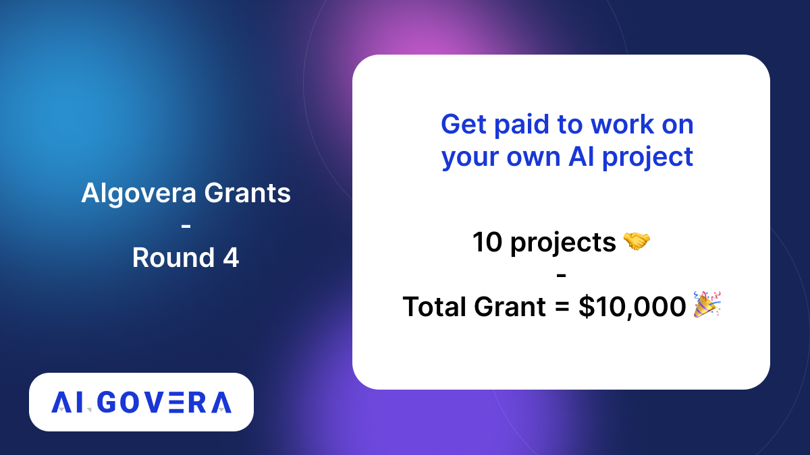

_Announcing the winners of the Algovera Grants Round 4_

<!--truncate-->

## Community Winners

### 1. Decentralised Ownership: A Model for Safer AI?

This project by @BarefootDev proposes to research whether decentralised ownership can reduce the risk of misaligned or misdirected Artificial Intelligence. Check out the proposal here https://forum.algovera.ai/t/decentralised-ownership-a-model-for-safer-ai/110/6

### 2. Project Themistoklis

Project @p_Themistoklis is building computer vision models for drones to detect wildfires, survey biodiversity and monitor forest health. Read their proposal https://forum.algovera.ai/t/project-themistoklis-r4/96 & check out their website https://project-themis.com

### 3. Defining means to a web3 project: Finding synergetic collaborators and funders in a DAO

This project by @not_amyth aims to use an active inference framework for discovery of synergetic collaborators and funders in a DAO. Read the proposal here https://forum.algovera.ai/t/defining-means-to-a-web3-project-finding-synergetic-collaborators-and-funders-in-a-dao/115
@InferenceActive

### 4. Compass Labs: algorithms for liquidity provisioning to decentralised exchanges

@Labs_Compass by @EDuijnstee & @RohanTangri2 is building a dynamic liquidity provisioning system for decentralised exchanges by optimising for the users’ risk-adjusted return. Read their proposal https://forum.algovera.ai/t/compass-labs-algorithms-for-liquidity-provisioning-to-decentralised-exchanges/105 & check out their website https://compasslabs.ai

### 5. Alsats: active learning (for a few) sats

Alsats by @antaraxia_kk combines Active Learning for guided labeling of training data (for supervised machine learning) with micropayments using the Lightning Network. Read the proposal https://forum.algovera.ai/t/alsats-active-learning-for-a-few-sats/103, blog post https://web3ai.ghost.io/introducing-alsats/ and GH https://github.com/antaraxia/alsats

### 6. Microclimate-Strain Map

This project by @yishai_o aims to create a mapping of microclimates to optimal species, strains and suppliers of seeds and bio cultures. Read the proposal here https://forum.algovera.ai/t/microclimate-strain-map/120/2 The idea for this submission came out of a recent hackathon with
@phas3labs.

### 7. Capturing chaos: a fast, stochastic, and scalable approach to Lorenz-96

This project by @sciencedave_wv is building a fast, automated and scalable approach to modelling chaotic dynamic systems such as weather using a Bayesian approach in a Gaussian Process (GP). Check out the proposal here https://forum.algovera.ai/t/capturing-chaos-a-fast-stochastic-and-scalable-approach-to-lorenz-96/125

## Core Team Winners

### 8. Pytorch NFT checkpoint

This project by @elfouly_sharif proposes to build a custom PyTorch NFT checkpoint that hashes the current network weights, some metadata (data, accuracy, etc.) and eth address, which proves who did the network training. Read their proposal https://forum.algovera.ai/t/proposal-pytorch-nft-checkpoint/100

### 9. Eden protocol: Leveraging AI for better project/person matches

@edenprotocolxyz by @BluePanda_io, @impactbilli, @milo_io, and @wise_Tyy uses ML to analyze personal & project profiles to find matches based on skills, interests, previous experiences, endorsements, (social) interactions and availability. Read their proposal https://forum.algovera.ai/t/eden-protocol-leveraging-ai-for-better-project-person-matches/112/10

### 10. Decentralized AI DAO (DAID) Framework (Retroactive funding)

Algovera’s decentralized AI DAO framework (DAID) by @silentspring will accelerate your journey from AI project to a decentralized-AI DAO. It covers how to set up sustainable monetization options for your datasets and AI models to marketplaces, to tools for decentralized AI and even how to set up DAO community. Checkout the DAID framework here: https://miro.com/app/board/uXjVOvsD0uc=/?share_link_id=948533770979
