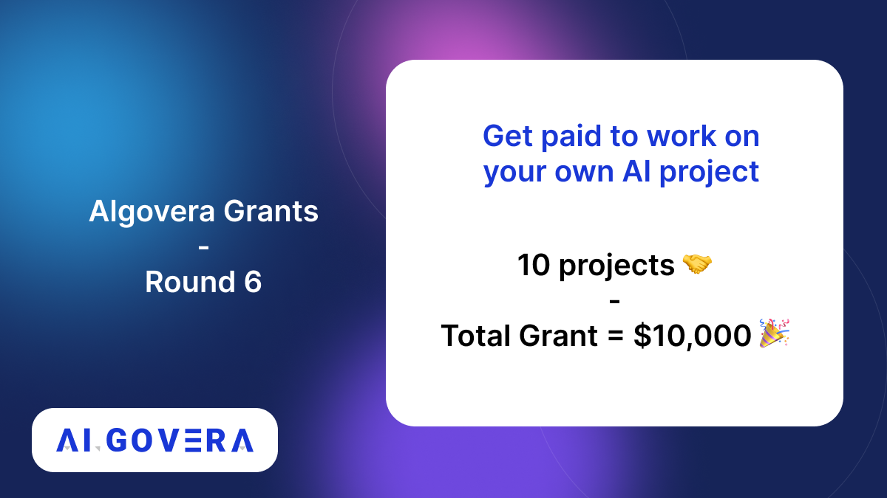
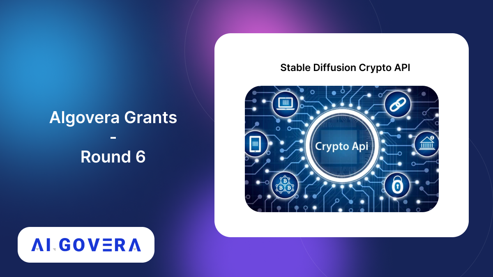
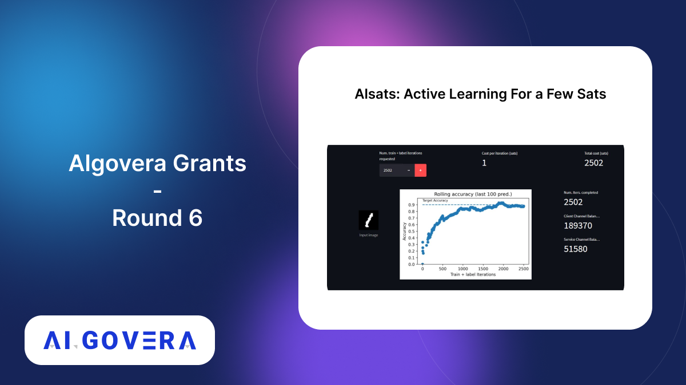
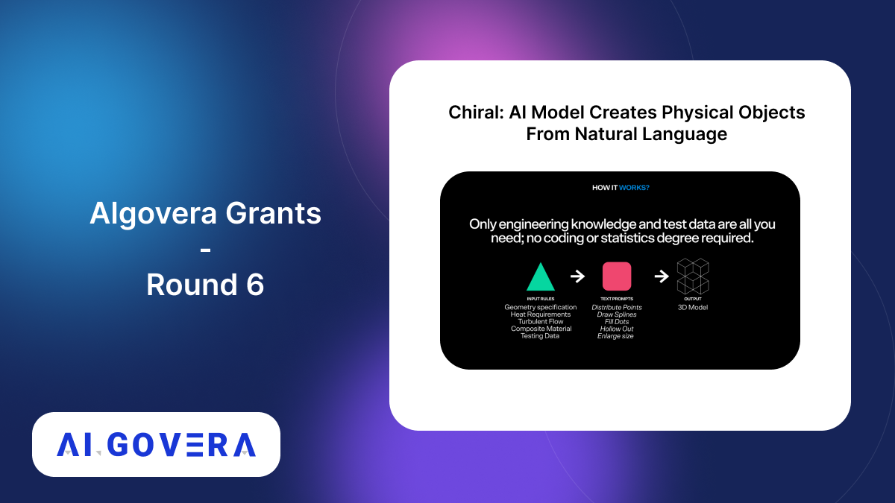
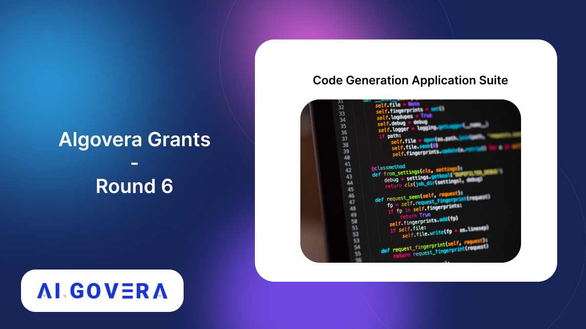
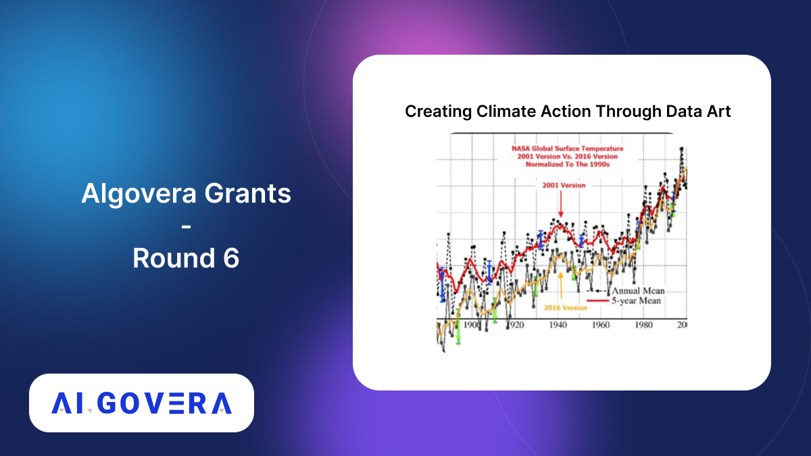
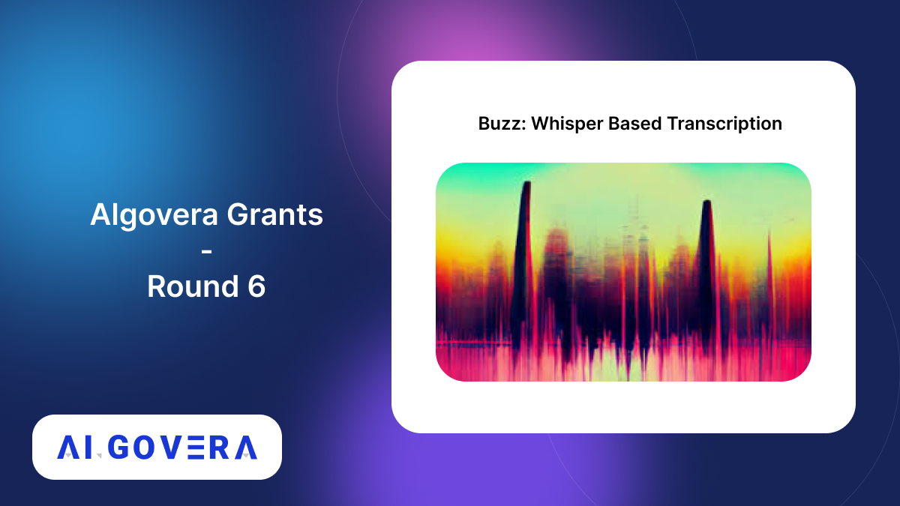
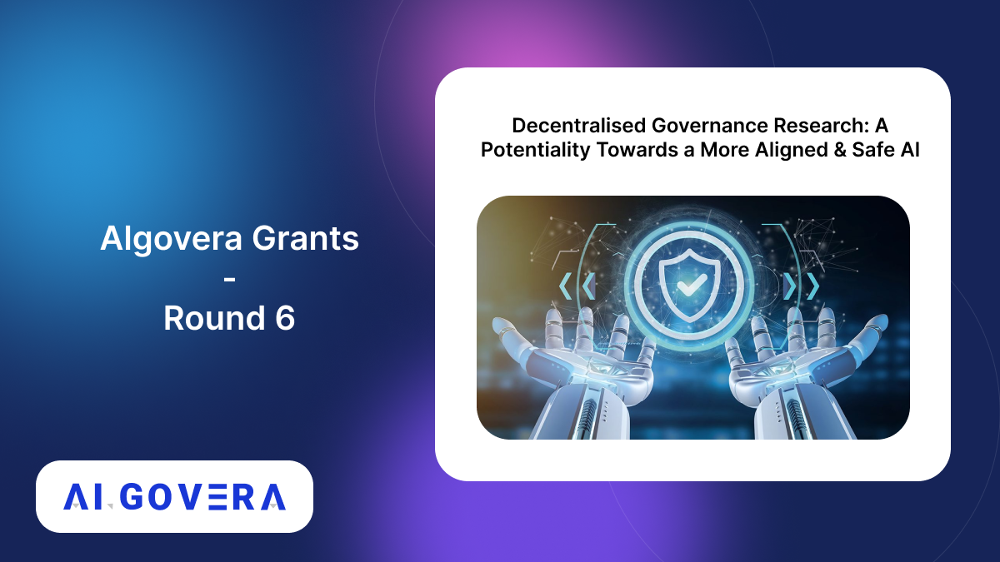
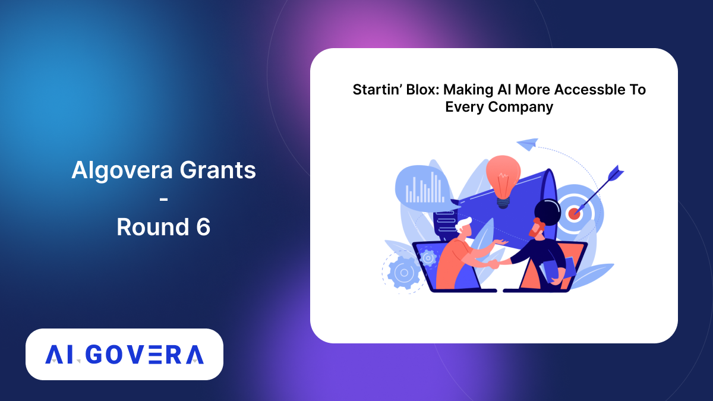
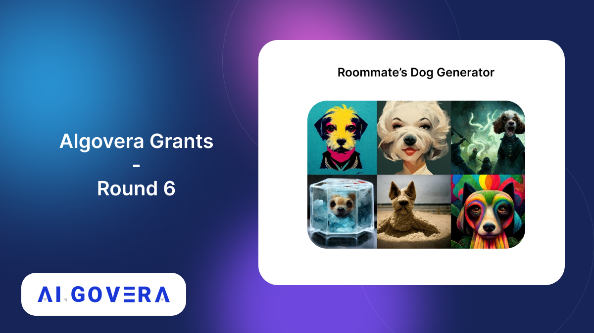

_Announcing the winners of the Algovera Grants Round 5_

<!--truncate-->

## Community Winners

### 1. Project Voodoo

This project by @not_amyth aims to use an active inference framework for discovery of synergetic collaborators and funders in a DAO. Read the proposal here https://forum.algovera.ai/t/finding-purpose-for-your-web3-squad-project-voodoo/188/6 @InferenceActive

### 2. Health X Change

Health X Change aims to compensate users in crypto in exchange for access to their health data. Data will be anonymized and aggregated across their user base and apply ML models to figure out disease state correlations with measurable biomarkers. Read proposal here https://forum.algovera.ai/t/proposal-health-x-change-structure-and-pull-healthcare-data-on-behalf-of-patients-in-the-us/186

### 3. ML + web3 Model Deployment Survey

This project by @devinaconley to conduct a hands-on survey of ML model deployment options for web3 use cases. Read the proposal here https://forum.algovera.ai/t/proposal-ml-web3-model-deployment-survey/177

### 4. Dspyt AI

A Uniswap centered Dapp that utilizes on-chain data to model potential price fluctuations in real-time. Read the proposal here https://forum.algovera.ai/t/dspyt-ai-uniswap-portfolio-tracker/184

### 5. SimPPL

SimPPL by @swapneel_mehta is Auditing (dis)information propagation landscapes on social networks to prevent the spread of news deserts by supporting local news organizations with data-driven insights and improve their reach. Read the proposal here https://forum.algovera.ai/t/proposal-auditing-dis-information-propagation-landscapes-on-social-media/163

### 6. Compass Labs

@Labs_Compass by @EDuijnstee & @RohanTangri2 is building a dynamic liquidity provisioning system for decentralised exchanges by optimising for the users’ risk-adjusted return. Read the proposal https://forum.algovera.ai/t/compass-labs-dynamic-algorithms-for-liquidity-provisioning-to-decentralised-exchanges/161

### 7. Eden Protocol

@edenprotocolxyz by @BluePanda_io, @impactbilli, @milo_io, and @wise_Tyy uses ML to analyze personal & project profiles to find matches based on skills, interests, previous experiences, endorsements, (social) interactions and availability. Read their proposal https://forum.algovera.ai/t/eden-protocol-leveraging-ai-for-better-project-person-matches/112/

## Core Team Winners

### 8. Multidimensional Reputation System

Replabs, ( https://replabs.xyz/ ) is building a multi-dimensional reputation system for determining legitimacy on social media using NLP.
Learn more here https://forum.algovera.ai/t/multi-dimensional-reputation-system-for-twitter/107

### 9. Proof of Learning

This project by @elfouly_sharif proposes to build a custom PyTorch NFT checkpoint that hashes the current network weights, some metadata (data, accuracy, etc.) and eth address, which proves who did the network training. Read their proposal https://forum.algovera.ai/t/proposal-adding-proof-of-learning-to-nft-callback/166

### 10. Large Language Model for Legal Dataset

This project aims to clean up the text in the free.law caselaw dataset, so that the dataset dataset is prepped for training a large language model. Read the proposal here https://forum.algovera.ai/t/clean-up-legal-text-dataset-for-machine-learning/159

