_Announcing the winners of the Algovera Grants Round 7_

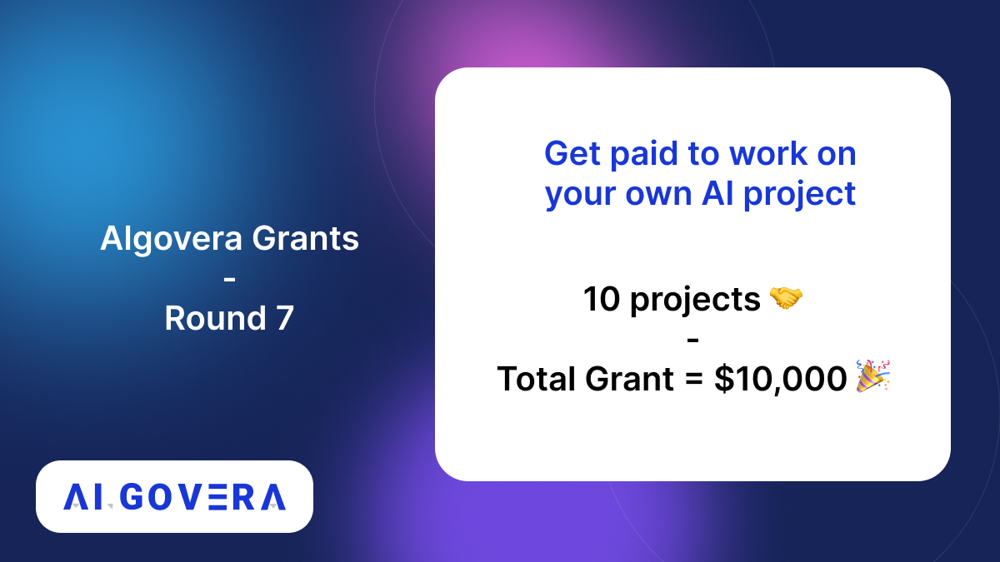

<!--truncate-->

## Community Winners

### 1. Lucidly | Text & Image Art Symposium

The project Lucidly is now allowing the model generate its own story through prompt generation with context and sound meaning. Check out the proposal [here](https://forum.algovera.ai/t/lucidly-text-and-image-art-symposium/282)

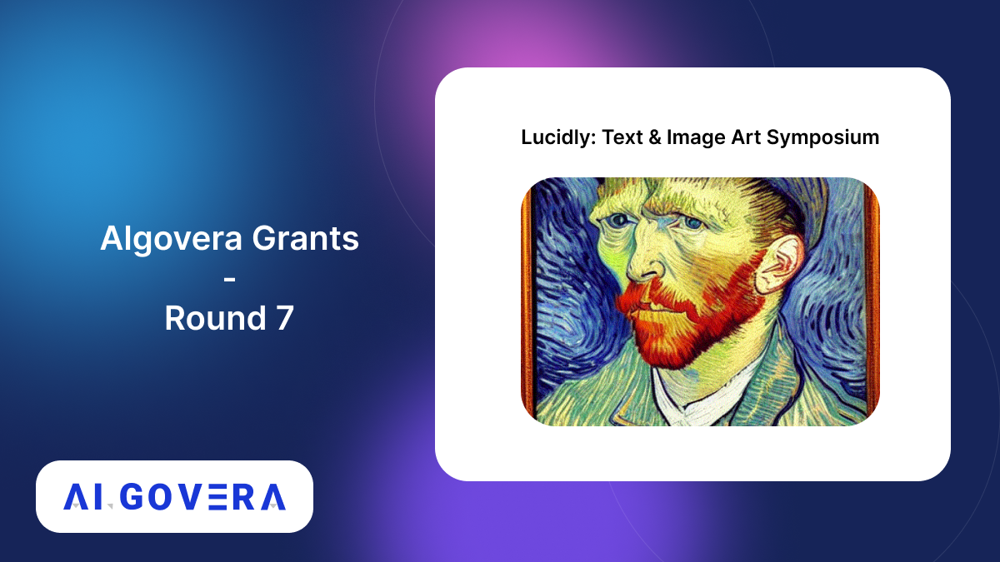

### 2. SimPPL

SimPPL will allow anyone external to a platform to evaluate the spread of online news examining which accounts spread it, when they spread it, and how much interest it garnered, all at the click of a button. Check out the proposal [here](https://forum.algovera.ai/t/proposal-creating-open-metrics-to-audit-coordinated-news-sharing-on-social-networks/285)

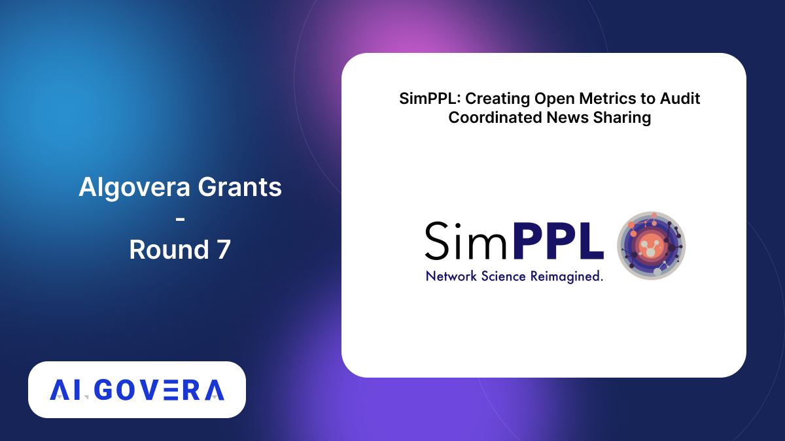

### 3. Algovera Academy

This project aims to create the spine and structures for the most communal AI learning initiative in web3. Read the proposal [here](https://forum.algovera.ai/t/algovera-academy-a-perennial-funnel-for-talent-and-ideas-into-the-community/277)

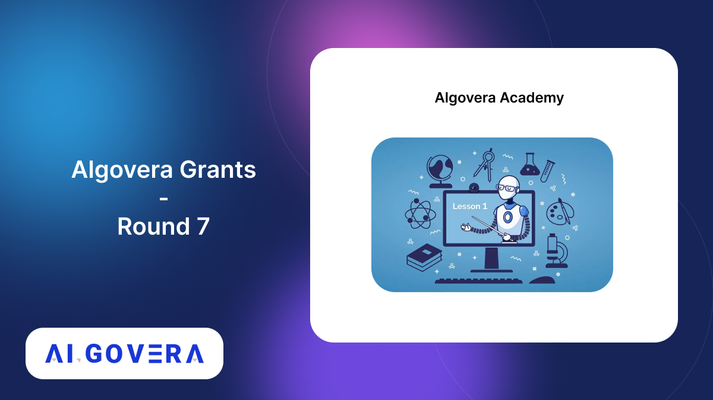

### 4. Lovely Tensors

[This project](https://github.com/xl0/lovely-tensors) is a python library that extends PyTorch with the ability to better summarize and visualize tensors in a human-friendly way. Read the proposal [here](https://forum.algovera.ai/t/proposal-lovely-tensors-lovely-jax/266)

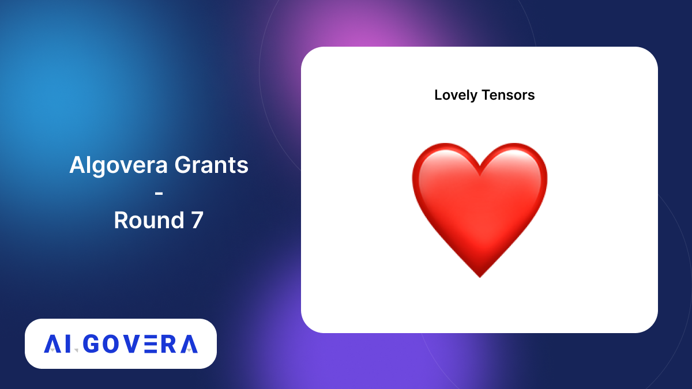

### 5. Human Evaluation of Methods For Fine Tuning LLMs

This project evaluates reinforcement learning and supervised learning as methods for fine-tuning large language models using human contractors. Read proposal [here](https://forum.algovera.ai/t/proposal-human-evaluation-of-methods-for-fine-tuning-large-language-models/269)

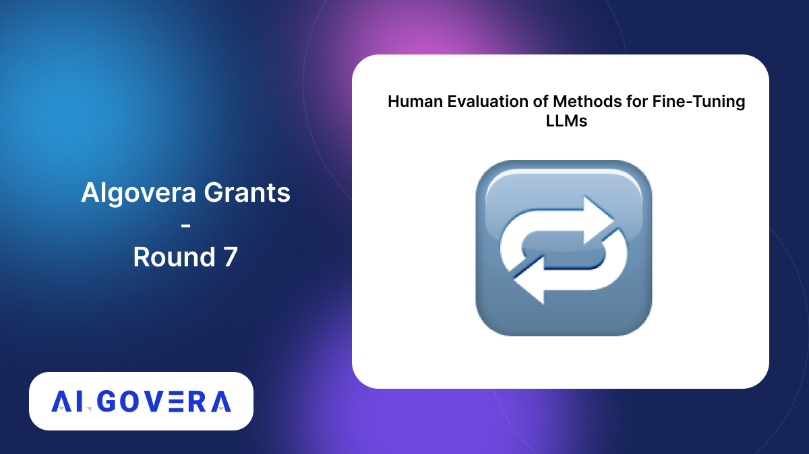

### 6. Compass Labs - Intellegent Algorithms For Defi

[Compass Labs](https://compasslabs.ai/) is building the AI infrastructure for optimizing and automating decision making in DeFi in a one-click solution. Check out the proposal [here](https://forum.algovera.ai/t/compass-labs-ai-infrastructure-for-optimizing-and-automating-decision-making-in-defi/268)

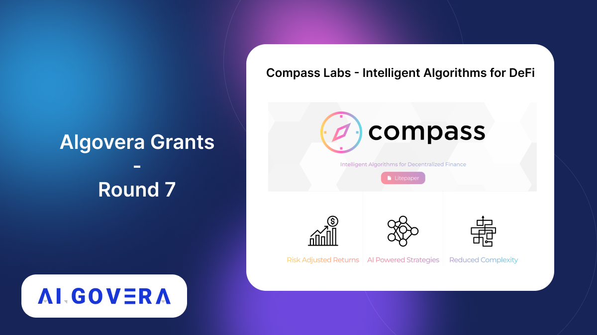

### 7. Earnings Call Analysis

This project assists financial analysts with investment decision making post a company’s earnings call. Read their proposal [here](https://forum.algovera.ai/t/proposal-earnings-call-analysis/280) 

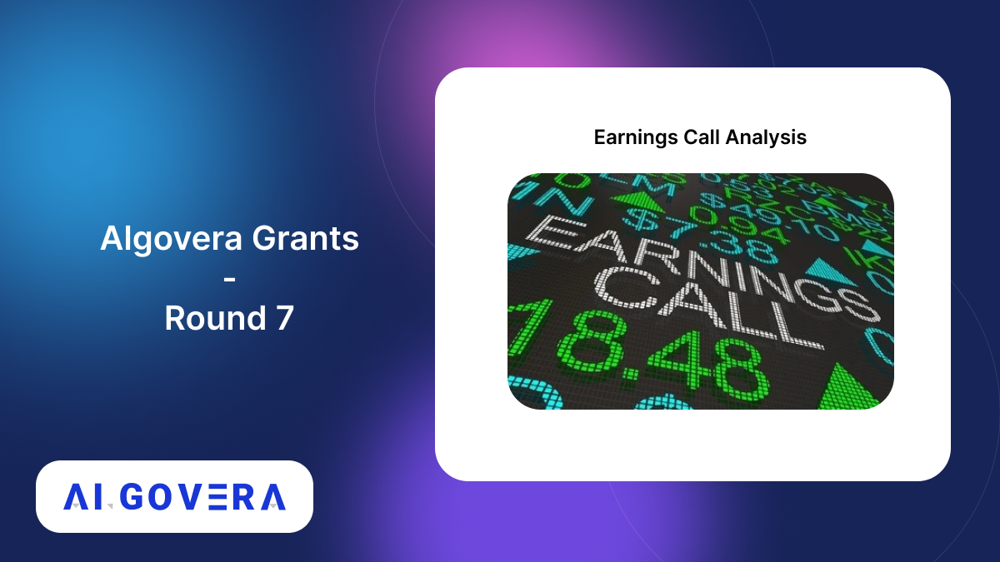

## Core Team Winners 

### 8. Prompt Extend

[Prompt Extend](https://huggingface.co/spaces/daspartho/prompt-extend) is a text generation model to extend stable diffusion prompts with suitable style cues. Learn more [here](https://forum.algovera.ai/t/prompt-extend-extending-stable-diffusion-prompts-with-suitable-style-cues-using-text-generation/258)

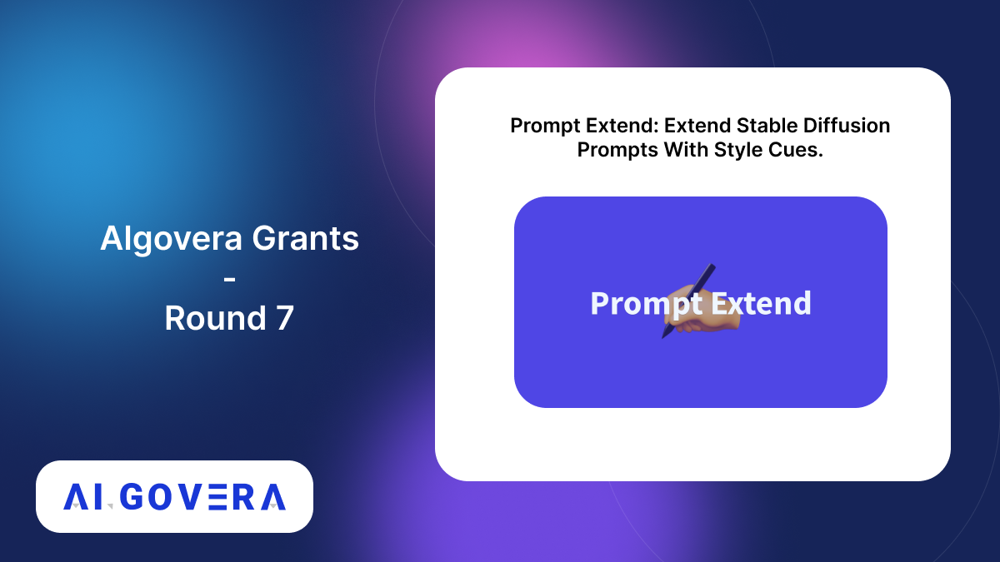

### Transparency in Coverage
This project will ETL and dashboarding for transparency in coverage data released by healthcare providers.Check out their proposal [here](https://forum.algovera.ai/t/proposal-transparency-in-coverage/259)

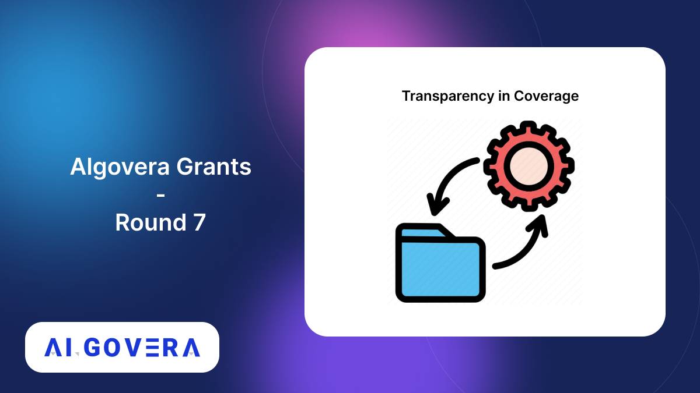

### 10. Paradigm of Legal Autonomous Behaviour (PLAB)
PLAB aims at demonstrating how Decentralised AI systems can be considered autonomous legal subjects capable of determining legal relationships arising by conduct in decentralised-based transactions. Read the proposal [here](https://forum.algovera.ai/t/the-paradigm-of-legal-autonomous-behaviour-plab/275)

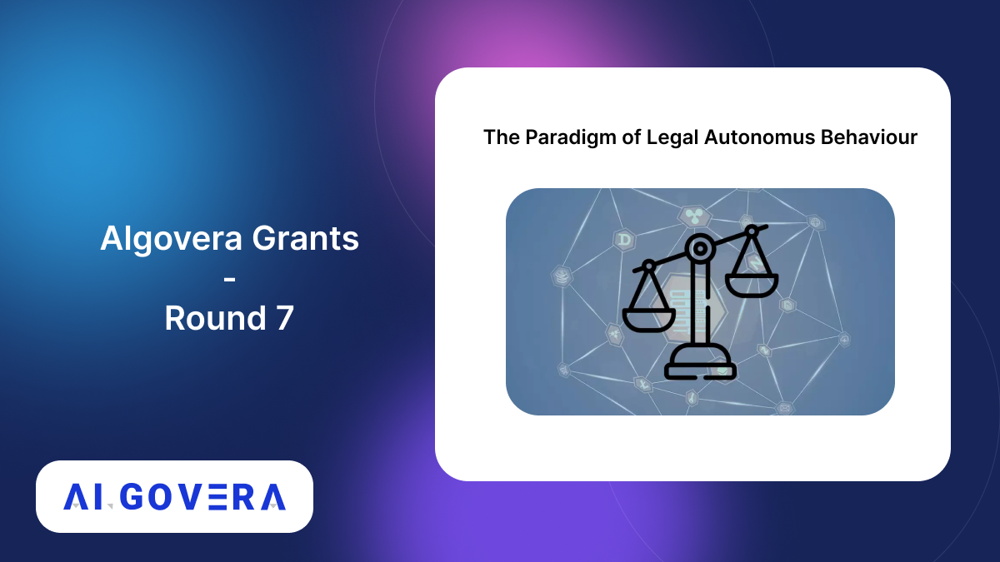

