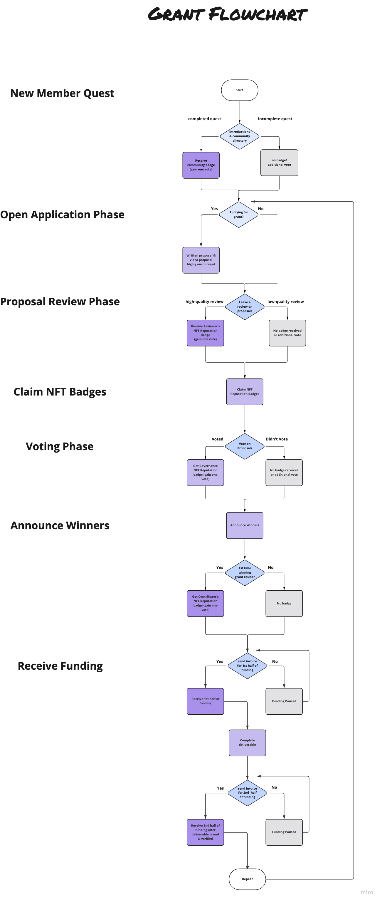

Algovera AI Grants give $10k in grant funding every month to allow AI developers more freedom to work on the projects they're passionate about. 

Below is a flowchart illustrating how the grant program works for projects that are applying; and, it will show you ways to earn more votes to influence which projects get funding 👇👇👇

<!--truncate-->

