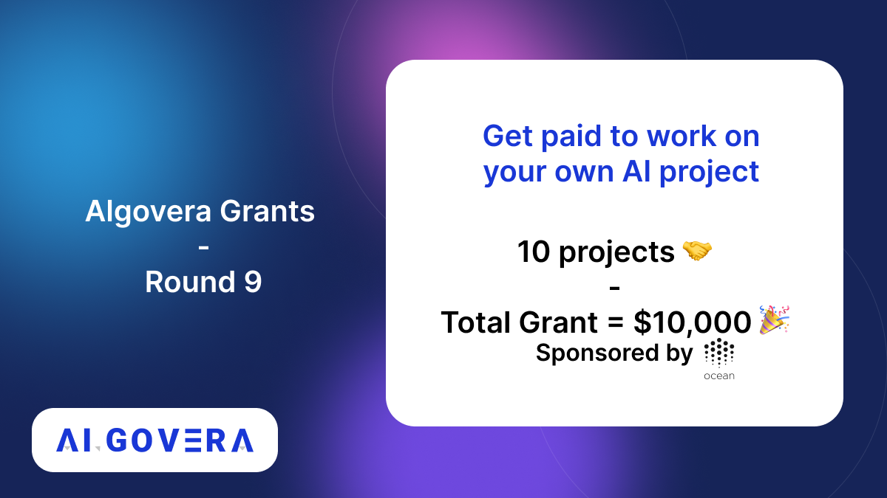
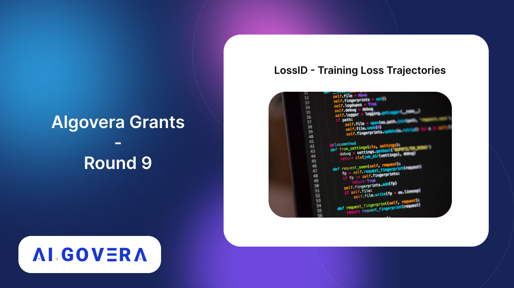

_Announcing the winners of the Algovera Grants Round 9_

<!--truncate-->

## Community Winners

### 1. Docs for trlX 

This project is developing the next generation Reinforcement Learning library for Transformers based architectures. Check out their proposal [here](https://forum.algovera.ai/t/docs-for-trlx-the-next-generation-reinforcement-learning-library-for-transformers-based-architectures/385)

### 2. AI for Traffic Analysis

This project is building a vision-based platform for analyzing and improving traffic safety. Check out their proposal [here](https://forum.algovera.ai/t/ai-for-traffic-safety-analysis/378)

### 3. SmartContracts.fyi

A one stop solution to understand and make your smart contracts better. Read their proposal [here](https://forum.algovera.ai/t/smartcontracts-fyi-one-stop-solution-to-understand-and-make-your-smart-contracts-better/386/7)

### 4. Dreamer

Dreamer is project building doctor’s brand with generative models. Read their proposal [here](https://forum.algovera.ai/t/dreamer-building-doctors-brand-with-generative-models/379)

### 5. ALsats - Active Learning sats

This project aims to reduce the investment needed to create minimum viable datasets for supervised machine learning. Read their proposal [here](https://forum.algovera.ai/t/alsats-active-learning-for-a-few-sats-3/391)

### 6. Research Framework for Hybrid-Intelligence

 This project is creating a conceptual & action-research framework for hybrid intelligence. Check out the proposal [here](https://forum.algovera.ai/t/conceptual-action-research-framework-for-hybrid-intelligence/369)

### 7. Client-side Conversational Machine Translation

This project will be able to use conversation mode with (multilingual) machine translation models in offline mode. Check out the proposal [here](https://forum.algovera.ai/t/proposal-earnings-call-analysis/280) 

## Core Team Winners 

### 8. Promptable.js

This project will build LLM pipelines in Typescript/Javascript. Learn more [here](https://forum.algovera.ai/t/promptable-js-build-your-llm-apps-in-typescript-javascript/357)

### AI Chatbot for Around The Blockchain Newsletter
This project is creating a Chat bot for the newsletter "Around the blockchain.”  Check out their newsletter [here](https://www.aroundtheblockchain.xyz/)

### 10. LossID
This project is Automating the identification of interest areas in neural networks through training loss trajectories. Read the proposal [here](https://forum.algovera.ai/t/lossid-identifying-targets-for-interpretability-tools-in-neural-networks/373)

