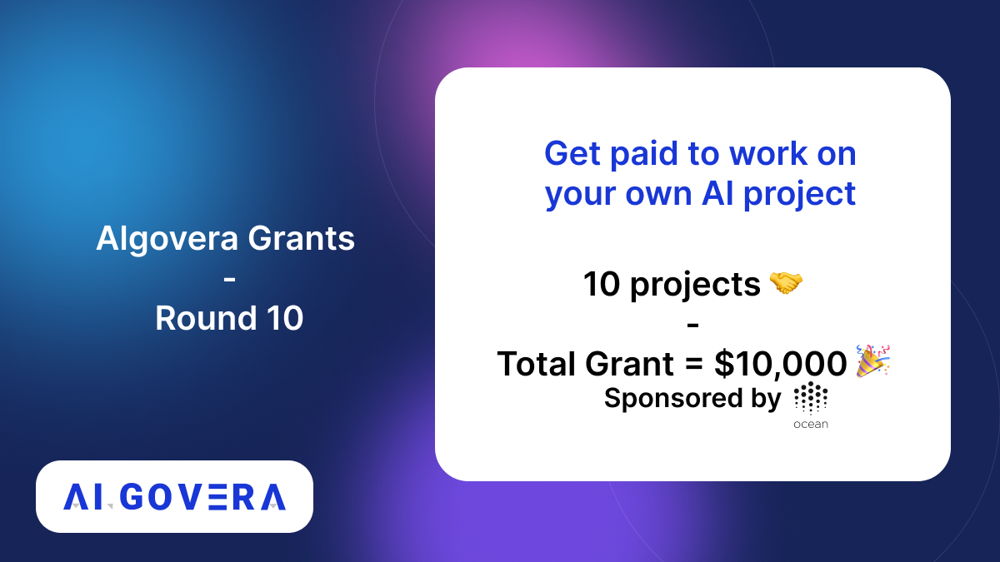
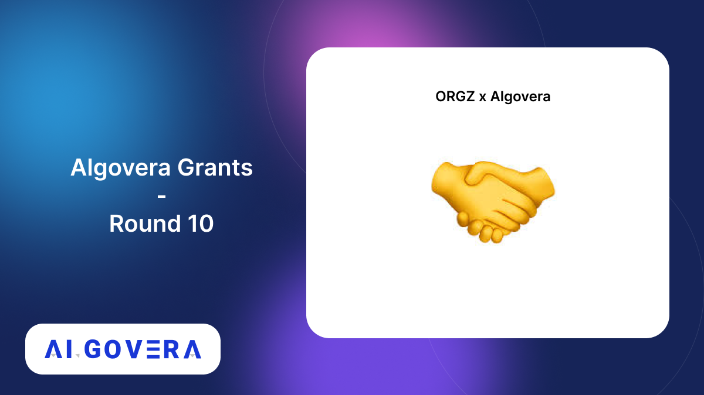
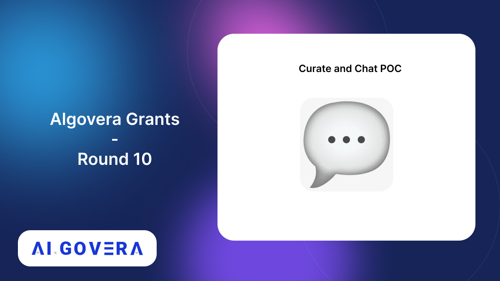
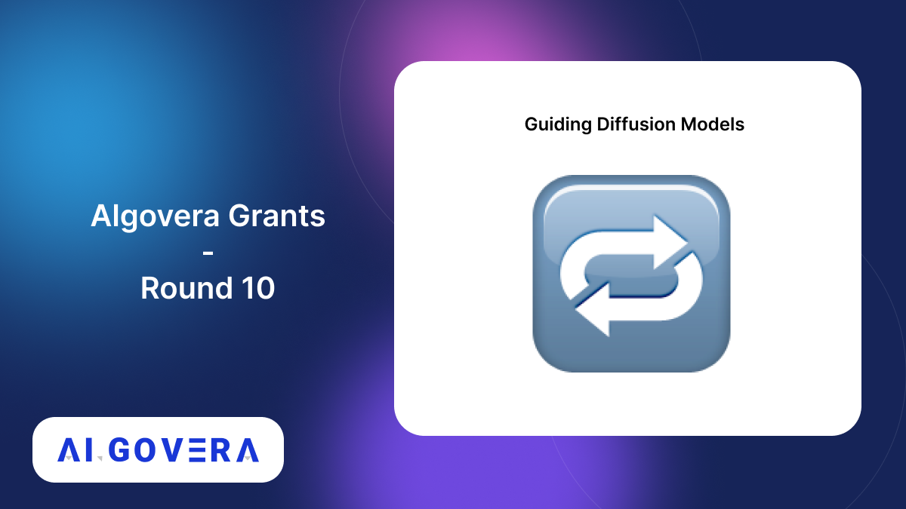
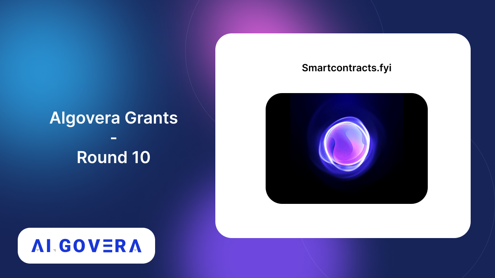
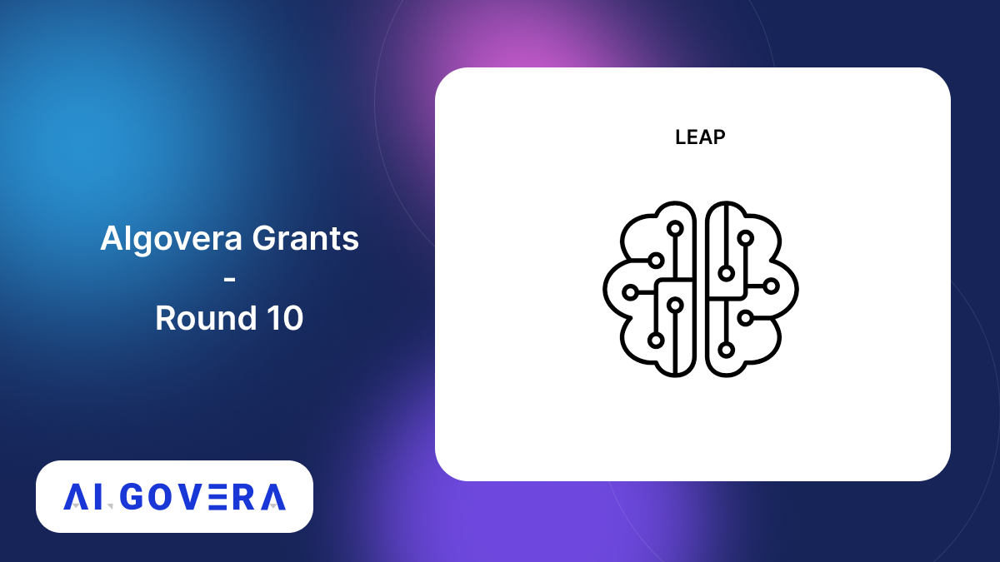
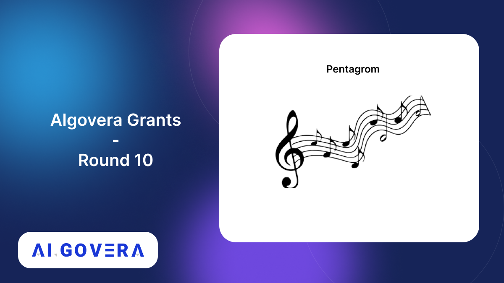
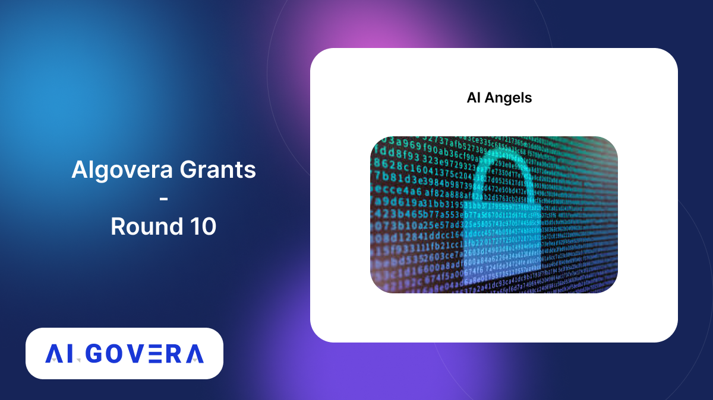
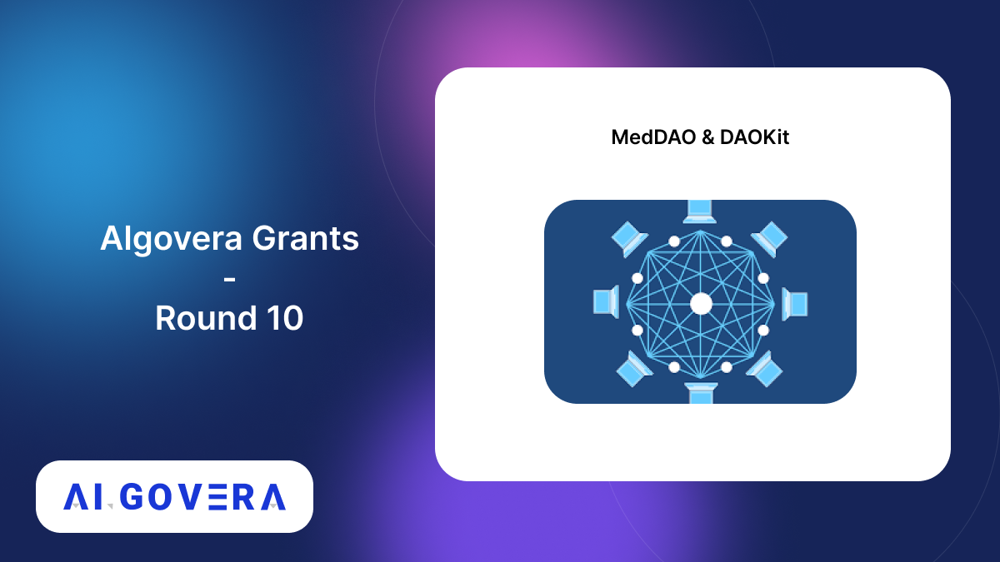
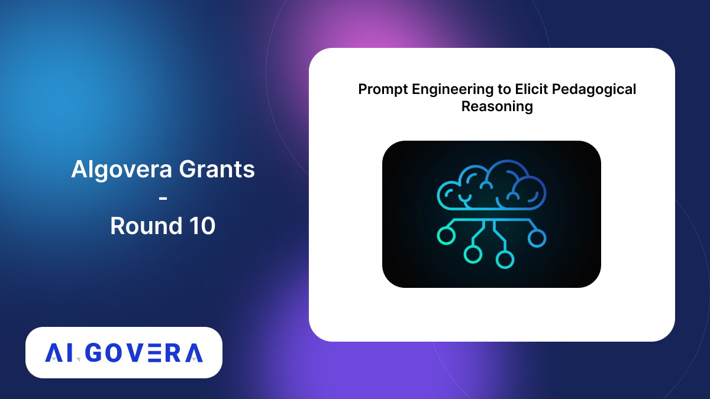

_Announcing the winners of the Algovera Grants Round 10_

<!--truncate-->

## Community Winners

### 1. ORGZ x Algovera

This project aims to implement an organizational design of a decentralized Algovera AI Commons. Check out their proposal [here](https://forum.algovera.ai/t/orgz-x-algovera-commons-begin-of-organizational-development-of-the-commons/464)

### 2. Curate and Chat POC

This project is building a community powered discord-to-knowledge base curation module. Check out their proposal [here](https://forum.algovera.ai/t/proposal-community-powered-discord-to-knowledge-base-curation-module/446)

### 3. Guiding Diffusion Models w/ Human-in-the-Loop

This project is training and guiding Diffusion models to generate images as per user-guided, either via text or image or both. Read the proposal [here](https://forum.algovera.ai/t/guiding-diffusion-models-with-human-in-the-loop/469)

### 4. Smartcontracts.fyi

Smartcontracts.fyi is a one stop solution to understand and make smart contracts better. Read their proposal [here](https://forum.algovera.ai/t/dreamer-building-doctors-brand-with-generative-models/379)

### 5. DAOMasons

DAOMasons is building DAO applications and are working on an AI model in order to aide contribution value analysis. Read their proposal [here](https://forum.algovera.ai/t/alsats-active-learning-for-a-few-sats-3/391)

### 6. LEAP

 LEAP developes a method for fast fine-tuning for models using a local minimum as initial weights. Check out the proposal [here](https://forum.algovera.ai/t/leap-fast-finetuning/448)

### 7. Pentagrom

Pentagrom is building Open source a music ML model using a 3x7 matrix for representing any music note [here](https://forum.algovera.ai/t/pentagrom-a-visual-representation-of-any-written-musical-note-using-machine-learning/463) 

## Core Team Winners 

### 8. AI Angels

To develop personalized AI assistants, we need to solve the problem of data privacy. This proposal is to explore a way to tackle this by combining ideas from edge computing and differential privacy. Check out the proposal [here](https://forum.algovera.ai/t/ai-angels-privacy-preserving-distributed-language-modelling/473) 

### 9. MedDAO & DAOKit

A Web3 decentralized pre-submission medical peer-peer review protocol for the creation of a novel on-chain dataset linking manuscripts and their reviews by verified physician specialists. Check out the proposal [here](https://forum.algovera.ai/t/proposal-for-round-10-microgrant-meddao-daokit/465) 

### 10. Prompt Engineering to Elicit Pedagogical Reasoning

This project will experiment with diverse prompt engineering techniques using OpenAI’s API to build a LangChain application that powers a Discord bot competent in reading comprehension tutoring. Check out the proposal [here](https://forum.algovera.ai/t/pentagrom-a-visual-representation-of-any-written-musical-note-using-machine-learning/463) 

