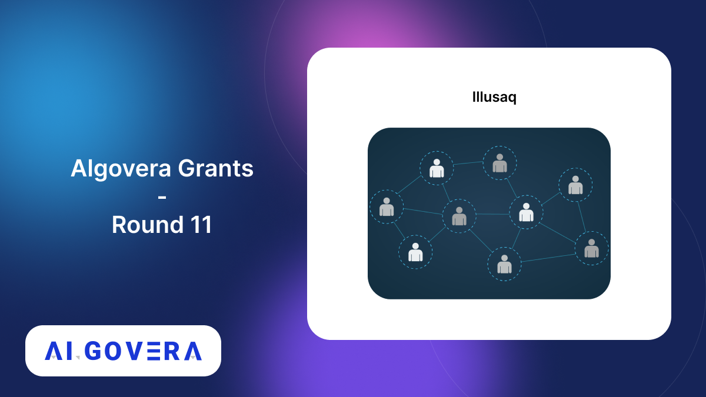

_Announcing the winners of the Algovera Grants Round 11_

<!--truncate-->

## Community Winners

### 1. ReAct - Recursive Transformers

ReAct (Recurrence for Attention) is attempting to explore how recurrence as a prior can help Transformers extrapolate to unseen datapoints during inference/deployment 🧠 

Check out their proposal [here](https://forum.algovera.ai/t/recursive-transformers-aiding-dl-models-to-better-extrapolate-on-unseen-data/498).

### 2. KI-LIFE

KI-LIFE² is creating of a Learning Assistant using AI / ML / DS for enhancing personal and collective cognition 🧠 

Check out their proposal [here](https://forum.algovera.ai/t/ki-life-the-knowing-intelligence-learning-interactively-for-everybody-and-for-enlivenment/508).

### 3. Science Letter

Science Letter has built an AI personalized Science Newsletter to easily keep up to date with research on any topic, in any language and in any format by leveraging AI 📜 

Read their proposal [here](https://forum.algovera.ai/t/science-letter-ai-personalized-science-newsletter/518).

### 4. ML + Web3 Deployment Survey

This project is conducting a hands-on survey of ML model deployment options for web3 use cases 🔥 

Read their proposal [here](https://forum.algovera.ai/t/proposal-ml-web3-model-deployment-survey-part-2/466).

### 5. Raven Finance

Raven finance is building Smart contracts based under-collateralized P2P lending and borrowing 🧠 

Read the proposal [here](https://forum.algovera.ai/t/raven-finance-smart-contracts-based-under-collateralized-p2p-lending-and-borrowing/514).

### 6. Wordable

Wordable is creating a model that generates a cohesive brand language with font, design palettes, etc for any digital brand given it’s context 🎨 

Check out the proposal [here](https://forum.algovera.ai/t/wordable-generate-marketing-style-for-businesses/510).

### 7. ALive

This project is an intuitive suite of generative AI-powered tools for animators to expedite and realize their creative potential 🎨 

Check out the proposal [here](https://forum.algovera.ai/t/alive-bring-your-imagination-to-life/519).

## Core Team Winners 

### 8. Prompt Extend

Prompt Extend - @daspartho has built an AI model to help with prompt engineering for Stable Diffusion by automatically generating suitable style cues for prompts 🎨 

Learn more [here](https://forum.algovera.ai/t/prompt-extend-ai-tool-to-help-with-prompt-engineering-for-stable-diffusion-by-automatically-generating-suitable-style-cues-for-prompts/511).

### Illusaq
This project is leveraging AI to build an interactive dashboards to learn about specific DAOs and the overall ecosystem 💡 

Check out their proposal [here](https://forum.algovera.ai/t/illusaq-interactive-dashboards-to-learn-about-specific-daos-and-the-overall-ecosystem/513).

### 10. Stable Diffusion Explained
This project is creating a series of videos going in-depth into how Stable Diffusion works 🎥 

Read the proposal [here](https://forum.algovera.ai/t/stable-diffusion-explained-series-of-videos-going-in-depth-into-how-stable-diffusion-works/522).

