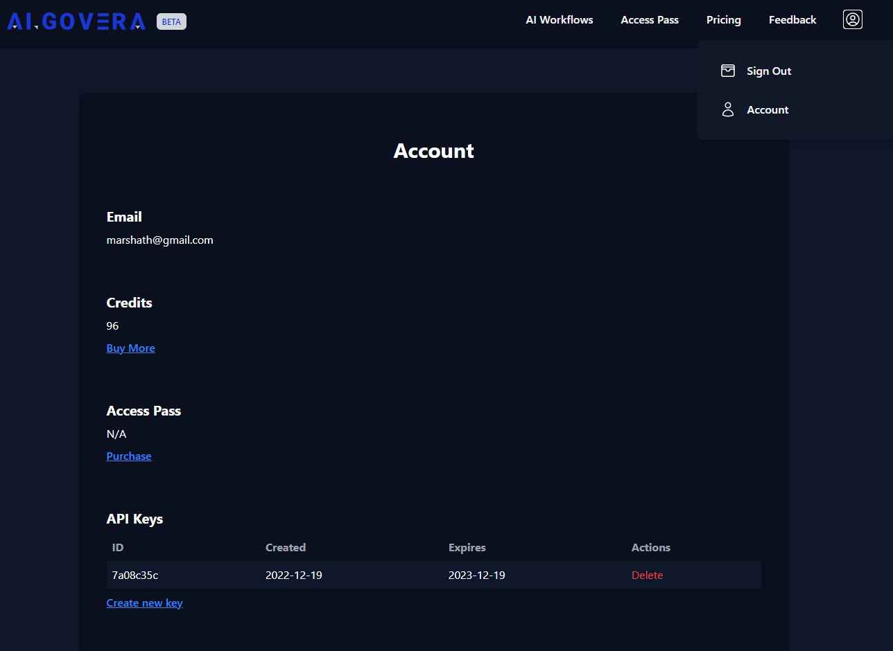

## Using Algovera's API

## Step 1 - Get your API key

For you to interact with Algovera's API, you would first need to generate an API key. You can generate the API key from [app.algovera.ai](https://app.algovera.ai/). Once you are logged in and purchased the credits, select `Account` from your profile. There you could generate your API key under the `API Keys` section.



**Note:** Make sure to copy and keep your key carefully. Keys will only be shown at creation.

## Step 2 - Interacting with the API key in Python

**Note:** For API documentation, you can refer to [api.algovera.ai/docs](https://api.algovera.ai/docs)

`APIEndpoint` : `https://api.algovera.ai`

#### Getting the available base models

```
import json
import requests

response = requests.get(f"{APIEndpoint}/api/basemodels")
models = json.loads(response.content)['base_models']
print(models)
['dalle',
 'stable',
 'stable diffusion v1.5',
 'stable diffusion v2-512x512',
 'stable diffusion v2-768x768',
 'stable diffusion v2.1-512x512',
 'stable diffusion v2.1-768x768']
```

The above call will return all the available models.

#### Posting a job

```
ept = f"{APIEndpoint}/api/txt2img"

payload = {
        'prompt':"What a beautiful world",
        'height':512,
        'width': 512,
        'inf_steps': 30,
        'guidance_scale':7.0,
        'seed':23165161,
        'base_model':"stable",
        "api_key": "YOUR_API_KEY"
    }

response = requests.post(ept, json=payload)
job_id = json.loads(response.content)['job_uuid']
print(f"job_id is {job_id}")
job_id is f988ff3ffa4b4145bd746c804cf39575
```

Once you post a job, it returns a `job_id` that your could use to check the status of the job as well as to retrieve the output of the job (in this case the image).

Payload contains params for the job as well as your api_key

#### Checking the status of your job

```
ept = f"{APIEndpoint}/api/status?job_uuid={job_id}&api_key={YOUR_API_KEY}"

response = requests.get(ept)
job_status = json.loads(response.content)['job_status']
print(f"job_status is {job_status}")
job_status is done
```

job_status can be `created` (the job is created and either is in queue or being processed), `done`, `failed`

### Get the output of your job

```
ept = f"{APIEndpoint}/api/getAsset"

payload = {
            "api_key": "YOUR_API_KEY",
            "job_uuid": job_id
            }

response = requests.get(ept, json=payload)

img = Image.open(io.BytesIO(res.content))
```
