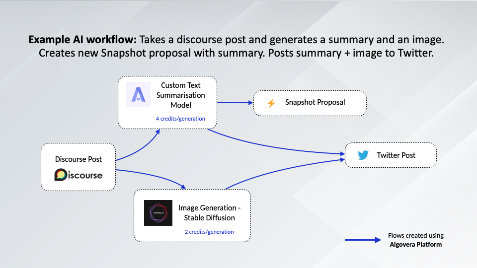
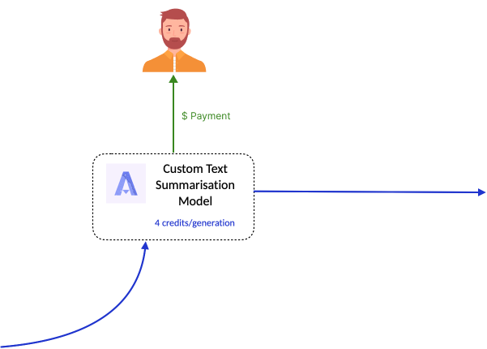
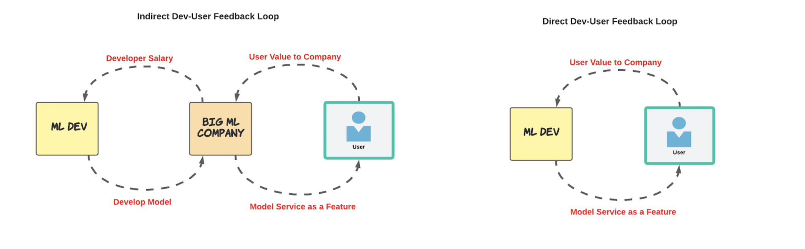
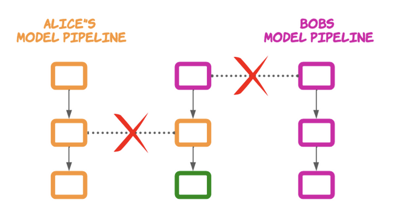

Algovera Flow is a platform that allows anyone to build and use AI workflows.

_AI Workflows_ = A pattern of activities/tasks that involves AI/ML.

_Component/AI Lego_ = A specific part of the workflow.

### Why build AI Legos?

_Be Independent and Earn an Income_

Being independent and earning an income as a Machine Learning Engineer can be difficult. You can become a consultant or enter competitions like Kaggle but you don’t truly own the work you produce. Algovera allows Machine Learning Engineer and Data Scientists to own the AI Legos they create, opening up a new way to earn an income. Algovera sets everything up for you so that you can build useful AI legos and get paid whenever it is consumed as part of a workflow.

_Directly User-Developer Feedback Loop_

When most machine learning pipelines are deployed, there can usually be a company interfacing developers and a consumer. For larger companies, tangible changes from user feedback can be slow as they would need to forward up and down the bureaucracy chain. This results in a broken/indirect feedback loop between developers and users.

_Modular Design_

Machine learning pipelines can be very difficult to create and maintain. Without modular design, developers will need to spend effort refactoring pipeline tools for different use cases. Sharable models are very compelling as they allow for developers to collaborate in ways not currently possible. Your creation can be used by others, expanding the use cases for your AI Lego.

### How to upload your AI Legos?

We are working towards a solution that allows you to upload AI legos as easy as pushing code to Github. In the meantime, we are partnering with builders to upload their components to the platform. If you would like to be considered to be an early builder, fill in this application (2mins): [https://airtable.com/shrUUi1Hdnc2R94nh](https://airtable.com/shrUUi1Hdnc2R94nh)
