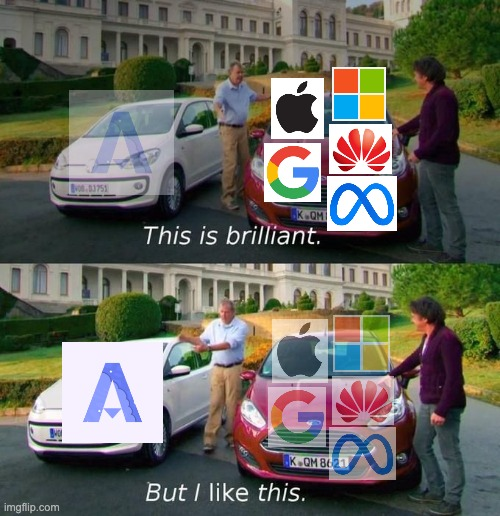

# Introduction to Algovera

## What is Algovera?
Algovera is a cooperative of people working to develop useful AI apps.
 
Algovera help facilitate and accelerate the development of decentralised AI products. Decentralized AI is a new concept and requires a different collection of tools, including data marketplaces and private AI technologies. Furthermore, working with teams distributed across the world requires new tools for coordination, governance and financing. To achieve this, Algovera combines existing technologies and creates new technologies where necessary. With such new tools and workflows, we also provide training sessions and learning resources for AI teams.

Algovera makes it easier and faster for AI teams to build useful apps. We connect AI specialists with data providers, software developers, business developers and investors. We train them up on how to use data marketplaces and private AI technologies. We provide grants to teams for their own exciting ideas, as voted on by the community. We connect them with partners that provide bounties for data science work that they have a need for. 

An organization like Algovera is a relatively new concept and you can think of it in a few different ways. AI Product DAO. AI Grants DAO. Web3 AI Consultancy. MOOC for AI in Web3. A global operating system for AI development.

## Why is Algovera needed?
There exist several barriers that hinder AI projects from becoming commercially successful. Building a ML model requires you to have large amounts of data. Acquiring and processing the dataset requires an enormous amount of upfront capital. Additionally, there are large overhead costs for an AI startup. Unless there is sufficient funding, failure is highly likely. 

The high barrier of entry for AI startups has caused the centralisation of AI. Big tech companies who have the capital, the data, and the expertise to process the data capture most of the value. 

From another perspective, Algovera has the potential to supercharge open source communities of AI researchers and developers that have become popular online. Communities like Eleuther.ai and fast.ai perform cutting-edge R&D. However, individuals contribute out of the goodness of their heart outside of the hours of their regular tech jobs, which pays the bills. What if AI teams could get paid for contributing to open source R&D? What if we could hook online communities up with Web3 rails, such as DeFi and DAO tooling?

Finally, a new global data infrastructure is being created where data from companies is being made available for the first time. These companies aren’t sure how to create valuable insights from this data. There is already a shortage of data scientists in the world, and most aren’t trained in using this new data infrastructure and associated technologies.
