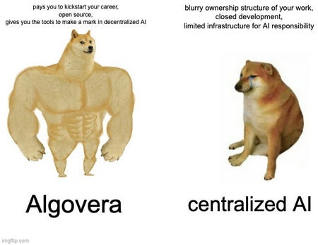

Our core mission is to allow anyone in the world to participate and benefit from the value created by AI. Our goal is to distribute the value created by the AI to those who contributed to make the AI. 

One of the outcomes of distributing value back to all the contributors is that we can take back control of AI from a handful of Big Tech companies. Our aim is to progressively decentralise the governance of AI. 

We are starting a creator economy for data science teams.

