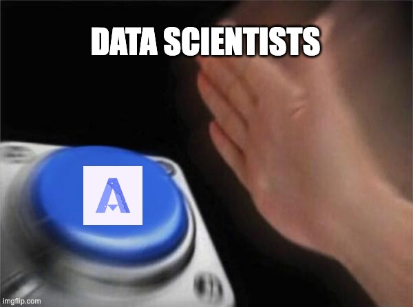

Welcome to the Algovera community, we're excited to build the next generation of AI infrastructure with you!

Before diving in to all our community has to offer, please take a moment to go through this orientation guide to ensure you have the tools you need to fully engage - whether you want to work on an existing project and get paid, submit your own project grant proposal, or simply start a conversation with like-minded folks, this guide will help set you on the right path.

**Things we'll be covering in the Orientation:**

- **First Action items**
    - How to get started in the community
- **Community Terminology**
    - How we organise people and time
- **Where to go for support and questions**
    - Discord channels
    - Discourse forums
    - Community Resource
