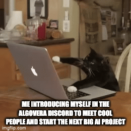

## Organising People: 

Algovera is organised around several types of distinct cooperative groups:

- Pods
- Squads

A Pod is a small group of people (usually capped at 4-5 members) focused on discussing and solving a general problem or challenge in our operational space. For example, a Pod could be formed to have a focused yet flexible discussion on the topic of decentralised storage solutions. Pods typically meet on a regular cadence (i.e. once per week) and members are encouraged to participate in each weekly meeting in order to maintain progress towards a solution. Participation in a Pod is voluntary and not currently a paid activity, though it is certainly possible for Pod members to submit a grant proposal and form a Squad.

A Squad on the other hand is a group of contributors (no membership cap) that is given funding by the larger Algovera community through our Grants Program for the explicit purpose of building a specific tool, feature, or product. Participation in a Squad is meant to be a paid endeavour, and Squad members are given autonomy to decide how their grant budget is spent. Decision making within a Squad will be facilitated through a decentralised governance structure, currently we use the DAOHaus DAO framework for Squad treasury governance. Since Squads are given funding from the main community treasury, there is a greater level of accountability for Squads, as they are required to produce deliverables and drive value back to the community.

Squad members can be paid directly from grant funds received, though individual contributors to a Squad project will also be given ownership of data science products that are released on the Ocean marketplace, or on Algovera's proprietary AI marketplace (Algovera marketplace is still under construction).

## Organising Time:

Within the structure of Pods and Squads, there are several distinct types of community meetings that can be organised:

- Townhalls
- Juntos
- Hacking Sessions

### Town Halls:
Our weekly townhalls are broken down into two main sections - Updates and Plans. The Algovera Core Team will share out relevant updates on pending action items in each Townhall in an effort to keep the broader community informed.
Additionally, the Core Team will share out plans for the upcoming week - these plans can include action items the core team is working on, as well as important upcoming events or milestones.

You can find all Townhall recordings [here.](https://algovera.notion.site/Town-Halls-690b96939d7d4b17b5f8b6bea788d7da)

### Juntos:
Juntos are meant to be informal discussion sessions where the wider community can get together on a video call and discuss particular areas of interest. Although Juntos are less structured than townhalls or hacking sessions, we believe they provide an essential forum for open discussion and exploration within the community.

Juntos are recorded so community members that were not present can still engage in the material. You can find recordings of all Juntos on our [Notion page.](https://algovera.notion.site/Juntos-acd3375453d548e18f9da18e83415aaf)

### Hacking Sessions:
Hacking sessions are hands-on meetings where members of a “Squad” can get together for tandem coding and concrete planning.

Hacking sessions are meant to be productive, and to help organize squad members toward completion of a specific goal. It is recommended that Hacking Sessions stay as organized and focused as possible to ensure proper progress toward the Squad goal. These sessions are open for everyone to join.

Similar to Juntos, hacking sessions are recorded for posterity and can be found on our [Notion page.](https://algovera.notion.site/Hacking-Sessions-02efbffcdae340cb93b39c57c18a9b9d)
