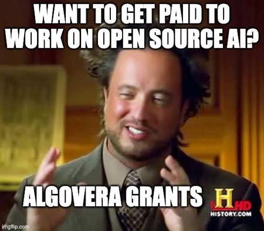

We envision a world where independent AI developers have the freedom to work on projects that they’re passionate about. These AI developers would keep ownership of their ideas and inventions, receive rewards based on their contributions and acquire passive income based on the value generated by their creations.

On our journey to date, we’ve realised that to achieve our vision of a thriving ecosystem of AI product/research startups, **it needs to be easier for independent developers to launch useful AI apps**. We’ve identified a few key pieces of infrastrucuture that we think are required:

* Funding Infrastructure
* Social Infrastructure
* Technical Infrastructure

### Funding Infrastructure

The Algovera microgrants program is designed to enable builders with early-stage ideas for projects that use AI. There is **$10,000** worth of grants (sponsored by Ocean Protocol) on offer each round with $3000 of this curated by the Algovera core team. The maximum grant for each individual project is $1000 (e.g. to fund one month of part-time work). The grants curated by the core team could be given to retroactively completed projects, projects that didn't reach the top 7 voted by the community, or the core team may decide to not fund all $3000 to projects if it doesn't meet the quality standards. In the case that all the funds by the core team aren't distributed they will roll onto the next round for core team to distribute. As of the end of 2022, we have given out 60 grants to 45+ unique projects.

### Social Infrastructure

It can be difficult to find co-founders, contributors, collaborators and investors for projects. While there are many events for academics and industrial professions in AI, the startup ecosystem in AI is less well developed. Algovera is a community of individuals and teams with many different skillsets and levels of experience. We organize many online community events including seminars and discussions, and are in the early stages of designing Algovera Academy for education and onboarding. Finally, we host and attend AI workshops at in-person conferences and events multiple times per year. We dream of organizing full conferences for AI startups and decentralized AI in future.

### Technical Infrastructure

We're building a platform that makes it as easy as possible for projects to get from idea to deployed AI app, workflow or assistant. The builders then have the choice of monetizing their creation, or just sharing open source with the world. You can check out existing workflows [here](https://app.algovera.ai/workflows).

Traditionally, building an AI product/research startup required a large number of distinct activities, such as collecting a dataset, developing and training an ML model, deploying that model and creating a user interface. These four activities involve stakeholders with very different skill sets e.g. domain expert, data scientist, ML ops, full-stack dev. The whole process could take many years. With large language models (LLMs) such as GPT-3, image models such as Stable Diffusion, and process models such as WebGPT, this process has started to become [unbundled](https://www.costanoavc.com/the-data-advantage-in-the-foundation-models-era/). A team can now develop workflows on top of a number of specialized model providers. Furthermore, the behaviour of general-purpose LLMs can be programmed on the fly through prompt engineering, reducing the need for fine-tuning on custom datasets.

_We're very grateful to [Ocean Protocol](https://oceanprotocol.com/) Foundation for sponsoring Algovera Grants._