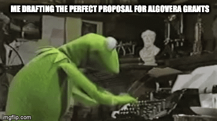

We are interested in funding projects at the intersection of AI and Web3. The main criteria is that **these algorithms or apps should have an innovative ownership model**. They should create value for the contributors, as well as the users. While we want ideas to form from the bottom up by individuals, we give some ideas below to get the juices flowing. The easiest way to meet the criteria is to use a similar process and technology stack to the one that we have developed (it should be possible to use the hacking sessions and other resources as a guide). One example is to **find an interesting private dataset** on the [Ocean marketplace](https://market.oceanprotocol.com/) **and add some value**:

- Perform an exploratory data analysis of the dataset (of the overall statistics rather than of individual samples) and publish the results to the marketplace.
- Process the data to a useful format and publish the processed dataset to the marketplace.
- Train an algorithm on the dataset and publish it to the marketplace.

There are many other decentralised data marketplaces with interesting datasets, such as [dClimate](https://www.dclimate.net/) and [Energy Web](https://www.energyweb.org/), as well tools such as [Dune Analytics](https://dune.xyz/browse/dashboards).

Another idea is to **build on top of existing machine learning algorithms and publish to the marketplace**. For example:

- Take an existing open source machine learning model (e.g. [VQGAN+CLIP](https://ml.berkeley.edu/blog/posts/clip-art/)), publish it to the marketplace and create a community around it using a DAO with the intention of building on top.

Does this create more value compared to building on top of the original open source model in the traditional sense? Good question. We think it might open up interesting new possibilities. Excitement often builds around newly-released models (e.g. [ArcaneGAN](https://huggingface.co/spaces/akhaliq/ArcaneGAN) on HuggingFace recently). The networks that form have inherent value. What if we formalised these communities and gave its members the ability to capture this value e.g. using shared treasuries, governance and funding mechanisms?

Another idea is to **build an app that integrates machine learning models with Web3 hangouts**. We would personally love a channel in our Discord that converts text to image art using VQGAN+CLIP (just like [EleutherAI](https://www.eleuther.ai/)) or other models. Or what about a voice channel with AI-generated music?

Perhaps you are interested in [token engineering](https://blog.oceanprotocol.com/towards-a-practice-of-token-engineering-b02feeeff7ca). So are we. Developing new **economic models for** (i) **distributing the value generated by AI** and for (ii) funding AI projects are huge problems that are not well explored. Where are the AI cooperatives that are owned by the workers? An example of a token engineering project proposal might be to:

- Use an open source token engineering software such as [TokenSPICE](https://github.com/tokenspice/tokenspice) or to run simulations for distributing the value generated by an algorithm or app to the members of a DAO.
- Use an open source token engineering software such as [cadCad](https://cadcad.org/) to explore new models for funding AI projects (like the [Commons Simulator](https://sim.commonsstack.org/) but for the needs of AI projects).

If you have a commercial (rather than a technical) background, some ideas for proposals include:

- **Perform some outreach with potential buyers of an algorithm or service**. For example, maybe there is potential to collaborate with Art DAOs on generative art profile pictures. Or, perhaps artists and creators might be interested in tokenising their datasets and algorithms that are currently off chain. Alternatively, **explore the market for an AI app that doesn’t exist yet**.

<iframe src="https://giphy.com/embed/PjltrbWBuDdZ5PigyJ" width="480" height="262" frameBorder="0" class="giphy-embed" allowFullScreen></iframe>

