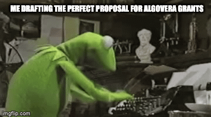

So you resonate with our mission and have an idea for a project. What are the next steps? Below, we talk about what the submission, discussion and voting process for Algovera grants will look like. If you have some suggestions for improvements, we’d love to hear them.

### Submission and Discussion

The first step is to write up a proposal for your idea (about one A4 page, less than 15 mins of work) following [this](https://forum.algovera.ai/t/grant-proposal-template/15) template. As a rough guideline, the deliverables might be designed to be achievable in one month of part-time work. The proposal should be posted to the Algovera Discourse forum under the [Proposals](https://forum.algovera.ai/c/proposals) category. Please format the title of your forum post with "Project Name: Very Brief Description" and please engage with members who ask questions or comment on the propsoal. You can optionally include a video (5 mins max) outlining your deliverables under your project proposal before the review period ends. If you are applying for a follow-on grant (i.e not your first time getting funded through Algovera Grants), ensure you showcase the progress of your previous deliverables. The review period allows for community feedback and discussion. This should take place primarily in the comments sections of the project posts in the forum.

### Voting

The Algovera Reputation Badge collection is meant to facilitate voting in Algovera Grants, where each Badge will award voting power to community members based on the criteria listed on the next page. Algovera Reputation Badges are meant to broadly capture the amount of activity and value that community members have produced in the community, particularly over the last calendar month. Your reputation aggregates, which means, the longer you contribute to Algovera, the more reputation you get and the more voting power you have. More details on the different forms of reputation and badges can be found [here](https://handbook.algovera.ai/docs/Handbook/Grants/Reputation%20Badges%20Criteria). 

We use NFTs for badges, since (i) it puts the user and not the platform in control of the reputation they accrue and (ii) they can be used with voting infrastructure that is less easy to game than something simple like polls. Votes will be hosted on the [Algovera Snapshot space](https://snapshot.org/#/algovera.eth). A walkthrough for claiming your badges and voting can be found [here](https://handbook.algovera.ai/docs/Handbook/Grants/Walkthrough:%20Claiming%20Your%20Reputation%20Badges%20and%20Voting).

As always, we are working to create tools and workflows that work best for the community and are actively making adjustments to our processes based on feedback. Please don’t hesitate to reach out to the core team on discord if you have any questions or suggestions!

_We're very grateful to [Ocean Protocol](https://oceanprotocol.com/) Foundation for sponsoring Algovera Grants._