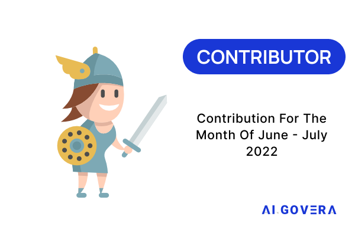
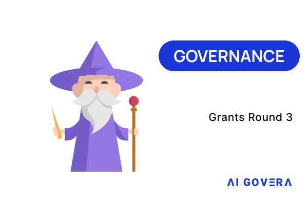
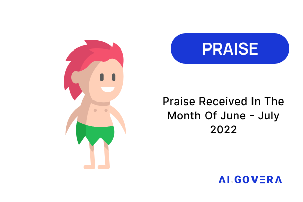
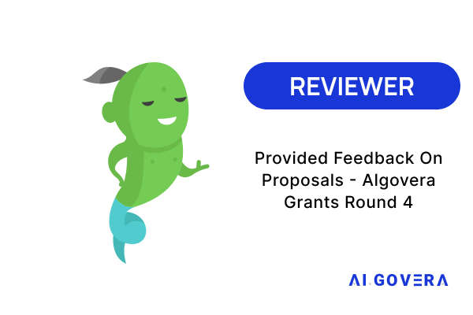

The following are the latest requirements to recieve Algovera Reputation Badges:

### Community

Any community member who has added their information to the [Community Directory](https://algovera.notion.site/6de7d47890334b8389b3ded588dd65ee?v=929373418cfa4c13b7d882c3b128cff2) using the form below will receive the Community Member Badge. You can add your information to the community directory [here](https://airtable.com/shrQPjhE9wxHbWKL2)!

### Contributor

Any community Member who has generated a [Cred Score](https://cred.algovera.ai/#/explorer) above 10 during the previous month or is a member of a newly funded Squad in the last month will receive the Contributor Badge. Cred Scores are calculated using default weights in SourceCred, and you can view the Algovera SourceCred graph here. We are constantly exploring ways to more accurately leverage SourceCred, so if you don’t think SourceCred is accurately representing your contributions please contact us in Discord and we can help troubleshoot!

### Governance

Any contributor who engaged in governance for previous voting rounds will receive the Governance Participant Badge. The goal of this tier of Badge is to reward and incentivize community members to participate in governance actions like voting for grants!

### Praise

Anyone who received praise through our [praise system](https://www.youtube.com/watch?v=Q85g4v220f8&t) during the previous month will receive the Praise Badge. Praises will be audited by the core team for authenticity. Each member is elible for a maximum of 1 Praise Badge per month.

### Reviewer

Anyone who gives constructive feedback to project proposals for the current round before the end of the review period will receive the Reviewer Badge. Feedback will be audited by the core team for authenticity. Each member is elible for a maximum of 1 Reviewer Badge per month.

*Note: We use NFTs for badges, since it puts the user (and not the issuer) in control. This means you would be able to use our Reputation Badges outside of our ecosystem in future.*