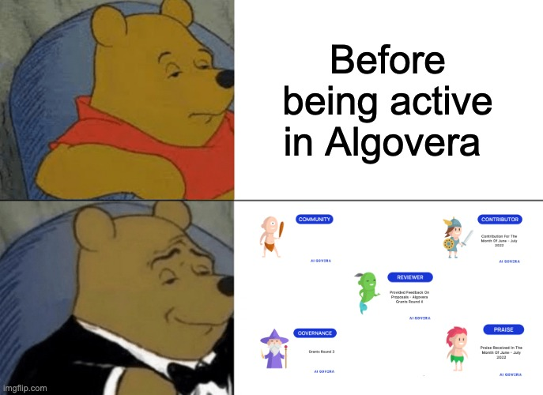

We use NFTs for badges, since it puts the user (and not the issuer) in control. This means you would be able to use our Reputation Badges outside of our ecosystem in future. In order for us to send you the Reputation Badges that you are eligible for, we need to know your wallet address. We also need to verify that your address is linked to your identity, so the best way is to send your wallet address to Hithesh | Algovera.ai#4001 through Discord. Once we have your address, we will keep your details in a database so that you don't have to send your information again.

We will **never** ask you for any other information than your public wallet address. Be careful with scammers on Discord!

<iframe src="https://giphy.com/embed/WkKrG4jJYmMmkoAzo2" width="480" height="270" frameBorder="0" class="giphy-embed" allowFullScreen></iframe>

