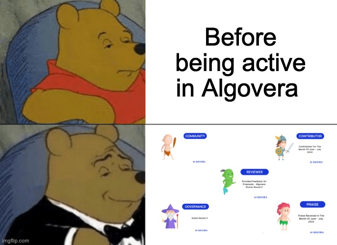
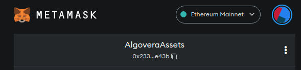
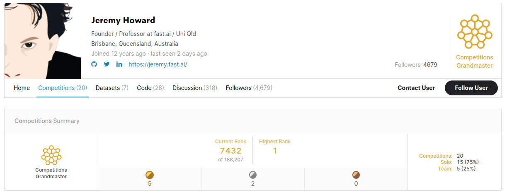

To receive Reputation Badges in the Algovera community and take part in voting for Algovera Grants, you will need to set up a Web3 wallet. 

## What is a Web3 wallet?

The word wallet tends to have financial connotations. However, wallets are often used in the real world as a place where you hold identity documents (such as a driver’s license). Similarly, Web3 wallets can be used for identity and reputation in the digital world. A single Web3 wallet can be used to log in to many different Web3 apps, meaning that you don’t need to register with a username and password for each. For example, using the same wallet, you will be able to log in to separate apps for:

* Checking your reputation
* Voting
* Creating datasets, algorithms and apps on Algovera Hub (coming soon) 

A wallet consists of a public and private key (i.e. public-key cryptography). You can think of the public key like your email address and the private key like your password. The public key can be easily determined from the private key, but not vice versa. Your public key can be shared, but your private key should not be shared with anyone. 

## How do I set up a Web3 wallet?

[MetaMask](https://metamask.io/) is by far the most popular Web3 wallet. It is installed as a browser extension, and kind of looks like your Google account dropdown menu. There is a good walkthrough for setting up MetaMask [here](https://docs.oceanprotocol.com/readme/metamask-setup). We want to continue to make it easier for data scientists to set up a wallet. For example, we created a [simple wallet app](https://huggingface.co/spaces/AlgoveraAI/web3-wallet) to generate a public and private key in Python on HuggingFace. This app doesn’t have the same security guarantees as other wallets, but it’s useful for inspecting and playing around with the basic functionality. In future, we hope to build a secure wallet app native to HuggingFace (in Python) that can be used within the HF ecosystem. We’ve also created a custom component for [connecting MetaMask to Streamlit apps](https://huggingface.co/spaces/AlgoveraAI/web3-wallet-streamlit) on HuggingFace. 

Now that you’ve set up your wallet, you can send your public wallet address (a.k.a. your public key) to wiseTy#8689 (Algovera's Community Manager) through Discord. This can be found by clicking on the fox icon for the MetaMask browser extension, and pressing the copy button beside the number that starts with 0x (see the image below). Once you’ve sent us your public address, we will send a Reputation Badge to your wallet.  We will keep your details in a database so that you don't have to send your information again to receive more Badges. We will **never** ask you for any other information than your public wallet address. Be careful with scammers on Discord!

## What are Reputation Badges (and why use NFTs)?

Data scientists may be familiar with reputation systems on other data science platforms. For example, Kaggle uses the [Progression System](https://www.kaggle.com/progression). HuggingFace uses Likes, and GitHub uses Stars. Within Algovera, we also want to allow community members to build reputation and receive [Badges](https://handbook.algovera.ai/docs/Handbook/Grants/Reputation%20Badges%20Criteria). We use NFTs for Badges, since it puts the user (and not the issuer) in control. This means you would be able to use our Reputation Badges outside of our ecosystem in future. In comparison, it is not really possible to use your Kaggle reputation outside of that platform. There is no interoperability. Imagine being able to see your Kaggle reputation on your HuggingFace profile. Ultimately, Web3 wallets and NFTs are your ticket to ownership of your online reputation.

## Where can I see my Reputation Badges?

In future, you will be able to log in to Algovera Hub and view your Algovera Reputation Badges (similar to Kaggle). We also plan to create apps on HuggingFace where you can view them. For now, you can use a website called [OpenSea](https://opensea.io/) (which is normally used for buying and selling NFTs). Once you navigate to the website, you will be asked to sign in with your MetaMask wallet. Once you sign in, hover over the circle in the top-right corner, and select Profile. Press the More button, and select Hidden (awesome UX, right?). Now you should see your Algovera Community NFT. You can keep track of other badges here too as you accumulate more reputation.

## How can I vote?
Voting will take place on [Snapshot Spaces](https://snapshot.org/#/algovera.eth/proposal/0x48ebf095f4c3edd097bcb9343134cba4915e597e26d42030ff159de22de4c618) (currently only the previous round is up). Once you navigate to the app, you may already be logged in (if you just signed in to MetaMask for OpenSea). For live rounds of voting, you will see a plus icon beside the different projects. More info coming soon.

_We're very grateful to [Ocean Protocol](https://oceanprotocol.com/) Foundation for sponsoring Algovera Grants._
