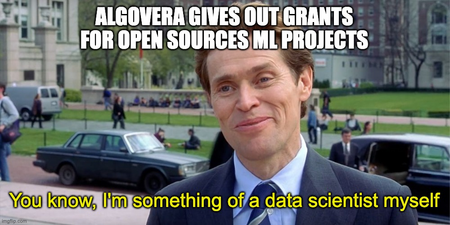

Funds are transferred directly to your wallet on Ethereum Mainnet. If you are applying as a group, we suggest setting up a [Gnosis Safe](https://gnosis-safe.io/) between the members.

We will transfer 50% of the funds up front and 50% once the deliverables are completed. **New squads will need to set up a meeting with core team** before the first trench of funding. This is to ensure that applicants are genuine and are not malicious actors.

If you are applying for a follow on grant, you need to have deliverables completed before the end of the application period (1st to 6th) to be eligible to apply for grants round. During review period - the community & core team assess the deliverables have been met. If no issues, remaining 50% is transferred.

If you are not applying for a follow on grant but wish to claim the remaining 50% of the fund: 
communicate with the core team that your deliverable are completed, post a video presentation of the deliverables under your original proposal, if no issues are raised the remaining 50% will be transferred. 
