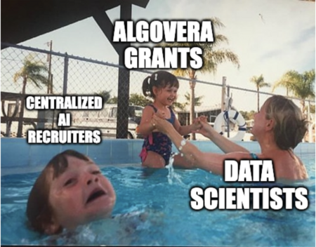

# Algovera AI Commons

## Why do we need an AI Commons?

AI is one of the most powerful technologies that we have access to. Currently, the majority of research and development takes place in teams in a few big companies and universities. The use of these resources is largely dictated by commercial interests in a top-down manner. Often, this results in the development of technologies that are harmful to society (e.g. surveillance, ad clicks, attention engineering). In our experience, generally well-meaning people can be persuaded to work on these technologies through top-down rigid hierarchies. We believe that new types of organizations can take us off our current path. Given the freedom and support to decide on their pursuit, we believe that independent teams will generally work on use cases that are better for the world. Apps can be collectively owned and governed by users and creators, with value generated flowing to more stakeholders. The aim is to put AI development and governance in the hands of many rather than a few. You can read more about our vision for AI ownership here. 

## How have we structured our AI Commons?

The Algovera AI Commons is a community of independent AI teams (called Squads), funded by Algovera Grants and building on Algovera infrastructure, to create useful AI applications. Some our current Squads are:

* DeepDeFi: Aiming to save users money when borrowing from popular DeFi protocols (using predictive AI models). You can check out a demo [app](https://www.loom.com/share/5ef7f17592bd4109945b7fdc2cf1eb17) their [website](https://deepdefi.algovera.ai/). 
* Themistoklis Project: Building a tool to collect synthetic data from virtual 3D worlds to train autonomous drones (e.g. using object detection for vision and natural language processing for decision making). Check out their [website](https://project-themis.com/). 
* Smart NFT Search: Aiming to make anything in the NFT space searchable with text. Check out their web [app](https://www.wat.to/).
* DAOkit: Creating a scripting language that integrates crowdsourcing of human intelligence tasks with smart contracts. Check out their demo [app](https://daokit.ndehouche.repl.co/) and [docs](https://daokit.ndehouche.repl.co/docs/index.html).
* Compass Labs: Building a dynamic liquidity provisioning system for decentralised exchanges by optimising for the users’ risk-adjusted return, to enable all retail investors to participate in liquidity provisioning. Check out their [website](https://compasslabs.ai/).
* Project Alan: Developing a novel neural network architecture based on the fundamental information flows of the human brain in order to provide the foundations of artificial general intelligence (AGI). Check out their Town Hall [presentation](https://www.youtube.com/watch?v=KFZgdVa7eTQ).
* Martians: Building a Web3 social media based recommendation system curriculum/toolbox.
* Munchies Index: Building a collection of scripts to mine text data from cannabis social media to teach a pre-trained language model to communicate using the idiomatic patterns of a niche audience. More information about the project here.

Squads can be ephemeral, and disband once they achieve their goals. Some former Squads:

* ML Model Profit Share: Exploring how to distribute value generated by AI apps using Arweave Profit Sharing Communities (PSCs).
* Decentralized Healthcare: Created a white paper for HopeDAO, which aims to address problems in mental health clinical trials, and creating smart contracts for decentralized clinical trials.

Our community also overlaps with many other communities and ecosystems:

* Ocean Protocol: We are one of the largest community-based projects in the OceanDAO ecosystem (where we’ve been working for over one year, completing 12 grants successfully). We work very closely with many projects in the OceanDAO ecosystem including DataUnion, LYNX, Opscientia and nCight.
* Protocol Labs: We are partially funded by the PL ecosystem. We have community members from many PL working groups including bacalhau/IPCS, Network Research (sub-team of Network Goods) and shared-zarr.
* DeSci: Many of our community members are heavily involved in the decentralized science world. We hosted a workshop on Decentralized AI at DeSci Berlin.
* TEC/TEA/Commons Stack: Some of our community are members of the Trusted Seed and Token Engineering Commons, and alumni of Token Engineering Academy. We have contributed to token engineering software such as TokenSPICE. 
* Kernel: We learned most of our community practices from our time in Kernel Block 4. We hosted many juntos and created a guild. Many of our oldest members joined. Check out our guild on decentralizing AI. 
