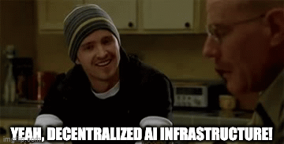

# Algovera Labs

The aim of Algovera Labs is to build infrastructure that makes it easier for independent projects in the AI Commons to create things. Algovera Labs is currently funded by grants and consultancy work. Different projects are split into working groups called Pods. A Pod typically focuses on a specific component of infrastructure. A typical process for starting a new Pod is something like:

* Ideate on infrastructure that would be useful for independent AI projects
* Design a project to develop this infrastructure
* Identify suitable funding sources, write and submit a proposal

Here are some of the active Pods in the organization. Currently, Algovera Labs has two funded Pods:

* Marketplace Pod: The Marketplace Pod is the longest running development work within Algovera Labs. The aim is to build tools, libraries and integrations to make it easier for AI teams to work with assets such as datasets, algorithms and apps. Labs has received 13+ grants from OceanDAO over the space of more than one year (e.g. [R19](https://port.oceanprotocol.com/t/algovera-publishing-data-science-notebooks-as-nfts-on-the-ocean-marketplace-round-19/1955)). We are currently building something like a user-owned version of HuggingFace. This is funded by the Ocean Shipyard program (you can check out an overview of the proposal [here](https://docs.google.com/document/d/1ATO7BoU5koG2CfluFOc_7qXCaLSmMM8LP9nbGLy27so/edit?usp=sharing))
* Storage Pod: The aim of the Storage Pod is to build tools that make it easier for AI teams to work with peer-to-peer storage using IPFS. Algovera Labs has received one grant from Filecoin to date (you can see the proposal [here](https://github.com/filecoin-project/devgrants/issues/517)) 
* DAO Pod: In the traditional world, it's really difficult to start a company and bank account with a team spread out over the world. With DAOs we can find team mates online, share a treasury, get online funding into this treasury and approve payments for work done towards a project. However, it is not possible for AI teams to publish and co-own IP related to data, algorithms and apps in a trustless manner, and there are no suitable tools for sharing profits generated by assets. Furthermore, existing tools are targeted at generic Web3 users, rather than AI teams. You can see the [proposal](https://docs.google.com/document/d/1o-cRZ7u8X-rNtHzaYIvyk5B6wYxBikYqfpixFel0S4U/edit?usp=sharing) for a grant that we submitted (but hasn't yet been approved).
* Compute Pod: The aim of the Compute Pod is to set up a compute instance that can be made available to the AI Commons. This Pod is currently unfunded.
* Notebook Pod: The aim of the Notebook Pod is to build a custom notebook environment that integrates with other components of the Algovera Labs infrastructure (such as marketplace storage, and compute)

Algovera Labs also provides consultancy work to help other projects to build on decentralized infrastructure

* [Digital Gaia](https://www.digitalgaia.earth/): We are working with this project to deploy Active Inference algorithms to monitor the earth and incentivize regenerative actions. You can read the Digital Gaia white paper [here](https://digitalgaia.notion.site/Natural-Intelligence-fa45119fa6224965b63c9cc2e0181dd8). 
